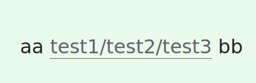
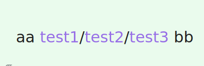
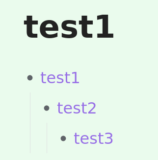
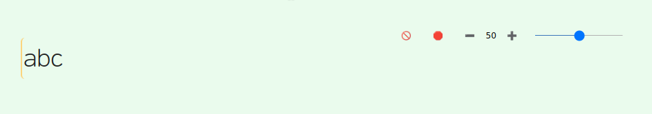
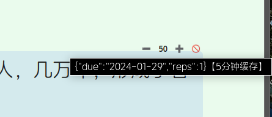
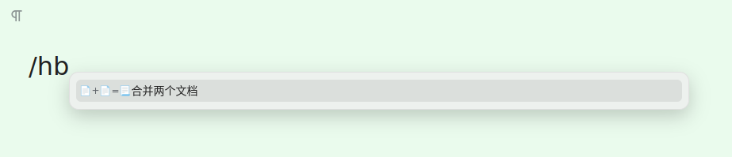
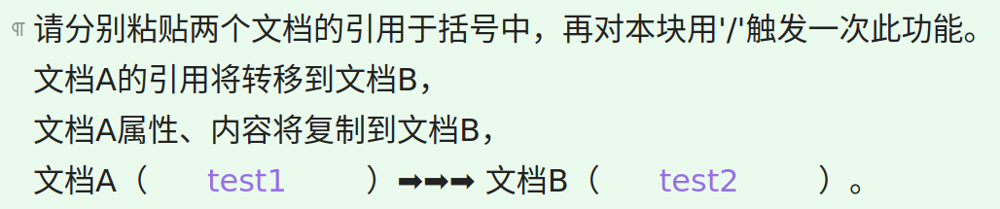
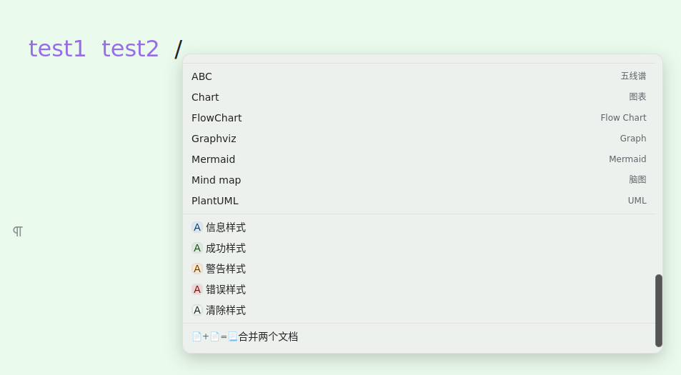
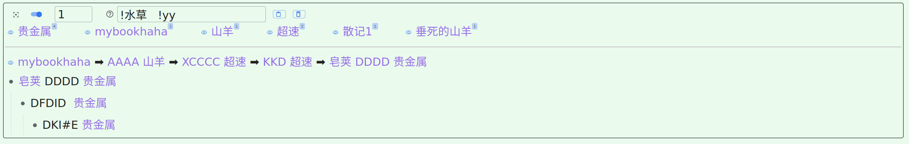
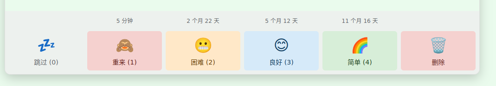

[SRC/源码](https://github.com/IAliceBobI/sy-plugins/tree/main/sy-tomato-plugin)

[English](https://github.com/IAliceBobI/sy-plugins/blob/main/sy-tomato-plugin/README.md)

# 番茄工具箱

> [我猜下面的图九成九是裂开了😢，看这里吧！](https://gitee.com/TokenzQdBN/sy-plugins/blob/main/sy-tomato-plugin/README_zh_CN.md)

## 配置


> [反馈建议，请到这里](https://awx9773btw.feishu.cn/share/base/form/shrcnO85H3V1iNvfEAc2JoQyXeh)

> [查看所有反馈，请到这里](https://awx9773btw.feishu.cn/share/base/view/shrcniyck0JM6yJS3rnj2xXGQ9f)

> [打赏鼓励，请到这里](https://gitee.com/TokenzQdBN/sy-plugins/blob/main/sy-tomato-plugin/README_zh_CN.md#bug%E5%8F%8D%E9%A6%88%E5%BB%BA%E8%AE%AE)

## 番茄钟

*状态栏番茄钟*


* **0**：取消倒计时
* **5**：计时五分钟
* ……
* **25**：计时二十五分钟


> 支持自定义时长。

> 新本能查看剩余时间。

> [打不开图片请看这里](https://gitee.com/TokenzQdBN/sy-plugins/blob/main/sy-tomato-plugin/README_zh_CN.md)

## 标签转引用

例如编辑器中打下内容：



回车，将得到三个引用文件：



其中顶级引用`test`，将插入带引用的列表内容：



> 带引用的列表，可表示出层级关系。`test1` `test2` `test3` 都可在自己的反链面板中查看层级关系。

> **注意：** 如果打开的文件包含标签，也将被转为引用，请慎用。

> 本功能默认关闭，请从配置中打开。

> [打不开图片请看这里](https://gitee.com/TokenzQdBN/sy-plugins/blob/main/sy-tomato-plugin/README_zh_CN.md)

## 闪卡优先级

对闪卡设置优先级，级别高的优先复习。同级之间每次复习，都会打乱顺序。

设置后，直接用`alt+0`复习即可。插件已在复习前，根据优先级对闪卡排序。

优先级保存在闪卡的自定义属性`card-priority`中。可手动调整，也可通过闪卡下方按钮调整。

优先级范围 0 ~ 100，默认优先级为50，没设置过优先级的闪卡也默认为50.



还可鼠标悬浮于优先级上，查看复习次数（reps）：



**需要点击内容块任意位置，以触发复习次数的加载。当`优先级`由普通字体变成粗体时，可以鼠标悬浮以显示复习次数。**

> 本功能默认关闭，请从配置中打开。

> [打不开图片请看这里](https://gitee.com/TokenzQdBN/sy-plugins/blob/main/sy-tomato-plugin/README_zh_CN.md)

## 命令块

### 文档合并

在思源编辑器内，随意找一空行，打下 `/`，然后选择`合并两个文档`：



得到提示，并在两个框内填入要合并的两个文档的引用。



最后，同样在此块上，打下 `/`，再次选择`合并两个文档`

将把左边的文档合并到右边：复制左边文档的内容、属性到右边，以及转移引用到右边。

例如图中，`test1`的内容、属性被复制到`test2`，其他地方对`test1`的引用，将全部转移到`test2`，变成引用`test2`。

也可以直接写2个引用，打下 `/`，然后选择`合并两个文档`：



> 本功能默认关闭，请从配置中打开。

> [打不开图片请看这里](https://gitee.com/TokenzQdBN/sy-plugins/blob/main/sy-tomato-plugin/README_zh_CN.md)

## 底部反链区

加入类似 `logseq` 的底部反链区。对于列表/大纲块，我们可以看到其上级与下级。上级从面包屑看，下级从内容中看。

例如整个列表为：


图中列表提到的`皂荚`文档内，看到的只有相关信息（上下级），直到根部，其他分支隐藏。并且把涉及到的引用（概念）与引用次数也列出，方便查看。

**点击反链面板内，链接前的`眼睛`图标，可以临时排除与其相关的反链内容，以作筛选。**


输入框内支持多个`关键词`实时搜索。



> [打不开图片请看这里](https://gitee.com/TokenzQdBN/sy-plugins/blob/main/sy-tomato-plugin/README_zh_CN.md)

### 搜索语法

**输入的`关键词`之间用`空格`隔开，如果`关键词`前面加上`感叹号`，代表反链中不能有此`关键词`。**

**比如：** `小明 小红 !老王 !王总`，将搜索到包含`小明`，并且包含`小红`，但不包含`老王`，也不包含`王总`的反链。

**多个`关键词`之间如果用`|`切分，代表这些`关键词`只要有一个出现即可。**

**比如：** `小明 小红|如花 !老王 !王总`，将搜索到包含`小明`，并且至少包含`小红`、`如花`中一个，但不包含`老王`，也不包含`王总`的反链。

**比如：** `小明 老炮 小红|如花|秋菊 !老王 !王总`，将搜索到包含`小明`与`老炮`，并且至少包含`小红`、`如花`、`秋菊`中一个，但不包含`老王`，也不包含`王总`的反链。

> `底部反链区` 默认关闭，请从配置中打开。

## 双向互链

如图两个文档《皂荚》、《山羊》，皂荚中引用了山羊的`aa`，`bb`两个块，我们对皂荚中内容使用`双向互链`功能，则会在山羊文档相关内容后添加反回皂荚的链接。

快捷键：`Alt+/`


> **提示** 可以多行选择，但需要使用快捷键：`Alt+/`。

> [打不开图片请看这里](https://gitee.com/TokenzQdBN/sy-plugins/blob/main/sy-tomato-plugin/README_zh_CN.md)

## 内容提醒

*给一个内容块设置个提醒日期吧！*

**光标定位好要选择的`内容块`**


**使用右键菜单。也可以用快捷键 `Ctrl+3`。**


**设置时间**


*设置时间好，会自动加上一个时间tag。*


*我们可以在tag面板查看已经计划中的提醒都有哪些。*


**提醒**


**删除时间tag**

*目前需要用户动手自给自足！*

> [打不开图片请看这里](https://gitee.com/TokenzQdBN/sy-plugins/blob/main/sy-tomato-plugin/README_zh_CN.md)

## 阅读点

*阅读点也就是一个文档上次阅读到的位置，我们把它记录到`书签`里面，并且自动删除当前文件内的其他`书签`。以保持本文件内只有一个`书签`。*

**光标定位好要选择的`内容块`，使用右键菜单，也可以直接 `Ctrl+2`。**


**之后要查看`书签`可以，可以直接看`书签面板`。也可以点击右上角的 `阅读点` (ctrl+4) 图标，查看更加详细的信息。**


> **注意** `阅读点` 图标的分组方式与书签面板的不一样。

## 复习时添加删除`闪卡`按钮

请在配置中开启`闪卡工具`。

> 图中最右边添加了删除按钮。

> 快捷键： ctrl+9



> [打不开图片请看这里](https://gitee.com/TokenzQdBN/sy-plugins/blob/main/sy-tomato-plugin/README_zh_CN.md)

## 清理失效`闪卡`

*如果闪卡所在的内容被我们删除了，这样的失效闪卡还存在于磁盘中。我们可以对其进行删除。*

**打开命令面板，选择 `清理所有失效闪卡`**


> **注意** 正在重建索引的时候，不要使用该功能。正在重建中的索引还不完善，插件依赖索引时会被误导，导致误删闪卡。

> **注意** 如果把`笔记本`关闭后使用，正常的闪卡也会被认为是失效的闪卡。所以使用时要打开全部笔记本。

> **注意** 使用前做好备份！

> [打不开图片请看这里](https://gitee.com/TokenzQdBN/sy-plugins/blob/main/sy-tomato-plugin/README_zh_CN.md)

## 超长内容操作

*超长内容的复制、移动、删除操作让我发疯！这里我使用了一种朴素的方法来对付这样的操作！*

> 操作后，如果发现内容缺失，请F5刷新一下，那只是操作太快，页面没来得及更新！

### 移动操作

*假设有`文档1`与`文档2`，在`文档1`中，用`aacc1`、`aacc2`两行包裹住要移动的内容，然后在`文档2`的某个位置插入`aacc3`，最后打开`命令面板`，选择`批量移动大量连续内容`即可*

**此移动操作会连同`闪卡`一起转移，不会改变`闪卡`的复习现状。而简单的`ctrl+c,v`会让涉及到的`闪卡`失效。**

> **注意** `文档1`与`文档2` 可以是同一个文档，也就是在同一个文档内移动或者复制。

> **注意** `aacc1`、`aacc2`、`aacc3` 前后不能有空格，不然插件找不到。

```
《文档1》

在黄昏的余晖中，
我漫步于林间的小径。
脚下的落叶沙沙作响，
微风轻拂着我的脸庞。

aacc1

枝叶间透出一丝光明，
如同岁月的记忆在闪烁。
我静静地倾听自然的呼吸，
感受生命在这片宁静中延续。

...这里有巨多内容...

这是一段与自然的对话，
我倾听着它们的声音，
我的心灵在这片宁静中得到滋养，
与大自然相互交融，共舞着生命的旋律。

aacc2

在这个喧嚣的世界中，
我寻找到了属于自己的一方净土。
在大自然的怀抱中，
我找到了宁静与自由的力量。
```

```
《文档2》

...
aacc3
...

```


### 复制操作

*类似移动操作，但要选择复制命令。*

### 删除操作

*类似移动操作，但要选择删除命令，且无需写`aacc3`。*

## 快速把列表制作为闪卡

对于一个列表:

* a0
* a1
  * a2
    * a3

原先要想给整个列表制卡比较麻烦，需要选择这个列表。如果只要光标在这个列表的随意一个位置就可制卡，那就方便了。于是有了这个`列表快速制卡`的功能。

我们可以把光标放在 `a3` 上，或者其他地方，`a2`、`a1`、`a0`都行，然后 `Ctrl+1`。或者打开`命令面板`选择`添加列表闪卡`。

**或者使用右键菜单**


## 图片遮挡（闪卡图片挖空）

**用法:** 对图片块，右键->插件->添加图片遮挡层。

本功能默认关闭，需要先在`番茄工具箱`的配置中开启`图片遮挡`功能。

**想看原图，可以双击图片中无遮挡层的区域。**

**支持图片缩放。老版本做的遮挡，需要重新编辑一下，才会支持缩放。**

**支持鼠标拖拽画矩形。**

> 为什么做此功能？
> 
> 我的需求与 [siyuan-plugin-flash-enhance](https://github.com/zxhd863943427/siyuan-plugin-flash-enhance) 的`图片遮挡`功能有点差异。希望图片一直处于遮挡，无论是否在闪卡复习中，除非鼠标悬浮其上，才会撤销遮挡。对于一个图片有多个遮挡层的情况，只有鼠标悬浮的那个遮挡层才消失。（部分代码参考了：[siyuan-plugin-flash-enhance](https://github.com/zxhd863943427/siyuan-plugin-flash-enhance)，感谢：[zxhd863943427](https://github.com/zxhd863943427)）

> [打不开图片请看这里](https://gitee.com/TokenzQdBN/sy-plugins/blob/main/sy-tomato-plugin/README_zh_CN.md)

## 移动内容到 daily note

将光标所在的内容块、选中的所有内容，移动到今日的daily note底部。

支持右键与快捷键，默认关闭，请从配置打开。

> 仅仅移动选中的单行或者多行内容，或者未选中时，光标所在块。

> [打不开图片请看这里](https://gitee.com/TokenzQdBN/sy-plugins/blob/main/sy-tomato-plugin/README_zh_CN.md)

## 取消任务的勾选

右键菜单，默认开启，取消当前文档中所有任务的勾选。

## 附加小功能


### 打开上一个/下一个 daily note

**最后2个图标，代表上一个、下一个 daily note**

> 默认关闭，请从配置打开："移动内容到 daily note" 功能。

### 打开闪卡

**那个闪电图标就是** 默认打开。

### 刷新虚拟引用

新本插件有，默认打开。

# 鸣谢

**感谢所有慷慨的支持者，你们的打赏对我的插件开发意义重大。**

* 2024-01 [QQQOrange](https://afdian.net/u/2c73a3c6a1f011eeb98a52540025c377)
* 2024-01 `燃烬`
* 2024-01 `*舟`
* 2024-01 [赐我一胖](https://afdian.net/u/74d98cf66f0711eda8ca52540025c377)
* 2023-12 [爱发电用户_WGH7](https://afdian.net/u/ceefbee4a48111ee983f5254001e7c00)
* 2023-12 [爱发电用户_Pv38](https://afdian.net/u/3911fecaa3ad11ee8fa95254001e7c00)
* 2023-12 [赐我一胖](https://afdian.net/u/74d98cf66f0711eda8ca52540025c377)
* 2023-12 [QQQOrange](https://afdian.net/u/2c73a3c6a1f011eeb98a52540025c377)
* 2023-12 [没头脑和不高兴](https://afdian.net/u/25e08b1eb1a511edbb3d5254001e7c00)
* 2023-12 [爱发电用户_EbBe](https://afdian.net/u/d11e3c741bc711ee95eb52540025c377)
* 2023-12 [爱发电用户_b2864](https://afdian.net/u/b286492496af11eea38752540025c377)

# BUG反馈、建议

[请填写：反馈表单](https://awx9773btw.feishu.cn/share/base/form/shrcnO85H3V1iNvfEAc2JoQyXeh)

或者 [看看大家反馈了什么](https://awx9773btw.feishu.cn/share/base/view/shrcniyck0JM6yJS3rnj2xXGQ9f)

或者到`QQ`群: 263961482

[或者到 Github 提交问题](https://github.com/IAliceBobI/sy-plugins/issues)

[或者到官方论坛提交问题](https://ld246.com/tag/siyuan)

# 打赏、鼓励、催更 🎉

<div>

</div>
<br>
<div>

</div>

**[或者移步，爱发电](https://afdian.net/a/playerv5)**

# 更新日志

## 2024-01-31

* 在嵌入块内点击闪卡优先级按钮，不再触发嵌入块的弹窗。
* 刷新虚拟引用增加快捷键。
* 添加工具：取消当前文档内所有闪卡。

## 2024-01-30

* 更新依赖库

## 2024-01-29

* 底部反链：颜色上区分本文档链接与其他文档链接。一键隐藏本文档链接。复制、移动外部文档链接到本文档底部。
* 底部反链：修复引用计数不准的问题。

## 2024-01-28

* 标签转引用功能调整：排除标签后缀 `.html` `.xhtml`
* 标签转引用功能调整：排除标签前缀 `@` `tag`

## 2024-01-27

* 调整闪卡优先级按钮位置。

## 2024-01-26

* 定期提醒添加复制ID功能。
* 添加右键菜单，取消当前文档中所有任务的勾选。
* 点击闪卡右上方的优先级，可以直接输入新优先级。

## 2024-01-25

* 改进刷新虚拟引用功能。
* 查看阅读功能放入右键菜单，手机也支持生成阅读点目录文件。生成后，需要手动开文件查看。
* 支持手机伺服
* 闪卡优先级增加随机性。

## 2024-01-24

* 添加刷新虚拟引用topbar图标。

## 2024-01-23

* 修改readme.
* 底部反链概念区，排除 "*"、"@"。

## 2024-01-22

* 底部反链：调整布局，减少干扰元素。
* 底部反链概念区，排除掉形如 `2024-01-22@第4周-星期一` 的dailynote.

## 2024-01-21

* 层级引用：最大限度避免重复创建引用关系。
* 修复bug，添加退出按钮：ipad图片遮挡，对话框太大，无法退出。

## 2024-01-20

* 闪卡优先级改为从对话框输入。
* 在闪卡下方添加增减优先级按钮。

## 2024-01-19

* 修改清理闪卡的提示时间。
* 优化daily note 遍历功能。

## 2024-01-18

* 更新依赖库。
* dailynote之间的切换，支持带`周`的日志名。例如：`/daily note/{{now | date "2006"}}/{{now | date "2006-01"}}/{{now | date "2006-01-02"}}-{{now | ISOWeek}}`

## 2024-01-16

* 闪卡优先级功能，全面提速。

## 2024-01-14

* 添加功能：标签转引用，引用保留层级标签的上下级关系。
* 标签转引用，提高速度，更加流畅。

## 2024-01-13

* 列表制卡重新设计，性能提高。

## 2024-01-12

* 底部反链概念区，排除掉形如 `2024-01-22` 的dailynote.

## 2024-01-11

* 优先级目前暂时使用部分排序的方式。

## 2024-01-10

* 增加闪卡优先级功能。
* 修复没打开闪卡优先级功能时，无法复习的bug。

## 2024-01-09

* 更新readme图片。
* 增加文档合并功能。合并包括引用转移、内容复制，属性复制。

## 2024-01-07

* 修复复习时，删除闪卡按钮会消失的问题。

## 2024-01-05

* 纠正批量删除内容块的帮助错别字。

## 2024-01-04

* 清理闪卡功能增加工作中的提示。
* 大幅提高批量复制的速度。
* 升级依赖库。

## 2024-01-03

* 为上一个、下一个日志，再增强可用性。

## 2024-01-02

* 优化了上一个、下一个daily note的性能。
* 快捷键不再在应用外也能触发。如果有快捷键冲突请自行设置快捷键。
* 为上一个、下一个日志添加快捷键：alt+q, alt+w。
* 为上一个、下一个日志，增强可用性。

## 2024-01-01

* 添加topbar打开闪卡按钮。
* 添加topbar打开上一个、下一个daily note按钮。
* 手机端不显示topbar图标。

## 2023-12-31

* 移除多余图标

## 2023-12-30

* 移动块到daily note: 提供默认笔记本配置。

## 2023-12-28

* `图片遮挡：遮挡标记为1~9,A~Z,之后是#.`

## 2023-12-27

* 图片遮挡：支持图片缩放。
* 图片遮挡：支持鼠标拖拽画矩形。

## 2023-12-26

* 底部反链：忽略渐进学习插件中书籍下的卡片文件。
* 番茄钟：添加查看剩余时间的按钮。

## 2023-12-25

* 底部反链：修改输入框长度。

## 2023-12-24

* 双向互链：修复在闪卡复习时读取不到文档名的bug。

## 2023-12-21

* 闪卡工具：删卡按钮优化外观。
* 闪卡工具：添加快捷键，使用时无确认框，直接删卡。

## 2023-12-20

* 闪卡工具：复习闪卡时，添加删除闪卡按钮。
* 闪卡工具：修改删卡按钮的提示，消除歧义。

## 2023-12-19

* 底部反链：添加分隔符。
* 添加新功能，移动内容块到 daily note.
* 底部反链：添加分隔符 again。

## 2023-12-18

* 底部反链：缩短`提及`缓存时间。
* 批量复制功能提供健壮性。
* 闪卡复习时，不显示`底部反链`。

## 2023-12-17

* 底部反链：增加放置于编辑器外的反链区，可从插件配置中开启。
* 底部反链：内部与外部，配置中只能打开一个。
* 底部反链：保留一种模式，方便维护。
* 底部反链：调整自动刷新的图标。

## 2023-12-16

* 底部反链吸附到最后一行。
* 提升底部反链的健壮性。

## 2023-12-15

* 底部反链的提及数量，文档之间互相独立。
* 底部反链的搜索框支持复杂语法。

## 2023-12-14

* 优化底部反链体验，提高流畅度，减少卡顿、闪烁。
* 修复底部反链闪现在长文档中部问题。
* 显示`提及`展开的进度。
* 底部反链添加排除功能，可以快捷排除不看的反链。

## 2023-12-13

* 底部反链区，增加提及开关。
* 反链查询框提供粘贴与清空按钮。
* `提及`数量可控。

## 2023-12-12

* 底部反链整体支持搜索。
* `双向互链`：如果要在文档内首行插入链接，则改为插入`具体内容`，而不是`文档名`。
* `双向互链`：修复BUG，链接带外观时，可能会生成重复链接。
* `双向互链`：插入文件首行的链接加入IAL，以避免链接重复插入到文件。

## 2023-12-11

* 修复反链出现在文件中间的问题。
* `双向链接`功能触发后，光标改为定位到块的最后。[*](https://github.com/IAliceBobI/sy-tomato-plugin/issues/6)
* 修复`双向链接`无法识别带外观的链接的BUG。[*](https://github.com/IAliceBobI/sy-tomato-plugin/issues/7)

## 2023-12-10

* 底部反链不再插入js嵌入块，不再修改文档内容。而是直接显示到页面底部。

## 2023-12-09

* 修改反链搜索框样式。
* 并发读取反链。
* 清理缓存。

## 2023-12-08

* [加入开关，控制插入反链同时，是否也插入一个一级标题，方便在大纲中快速定位反链。默认为关闭。](https://github.com/IAliceBobI/sy-tomato-plugin/issues/5)
* [修复刷新、编辑js嵌入块后的异常。](https://github.com/IAliceBobI/sy-tomato-plugin/issues/4)

## 2023-12-07

* 美化反链的引用数。
* 搜索部分反链使用 openTab，替换原来的"siyuan://"
* 更加彻底的提取相关反链（概念），以供查找。
* 插入反链、提及时同时插入一级标题，方便大纲定位。
* 不接收 protyle 销毁事件。
* 关闭Dialog时，销毁Svelte。
* 右键菜单菜单功同步到块图标菜单，以支持App端。
* 自动插入底部反链。提及需要手动插入。

## 2023-12-06

* 调整Dialog

## 2023-12-05

* 重构配置代码。
* [番茄钟支持自定义时长。](https://github.com/IAliceBobI/sy-tomato-plugin/issues/3)
* [修复BUG](https://ld246.com/article/1701445627641/comment/1701761268877?r=player#comments)

## 2023-12-04

* 底部反链区重新设计。
* [拆分反链与提及为两个独立菜单。](https://github.com/IAliceBobI/sy-tomato-plugin/issues/2)

## 2023-12-03

* 加入仿 `logseq` 的底部反链区。

## 2023-12-02

* 重构

## 2023-12-01

* 可配置各种功能是否开启。
* 增加极简反链面板。

## 2023-11-29

* 代码重构。
* 提醒部分使用svelte重写。
* 批量移动，删除，复制前检查block的存在性。避免引起重建索引。

## 2023-11-27

* 双向互链：把光标处的动锚改为静态的。并弹出提醒。

## 2023-11-25

* 支持复制带修改过外观的内容。
* 双向互链：给被链接的内容添加反向链接。

## 2023-11-22

* 修复BUG，删除失效闪卡功能误删文档闪卡。

## 2023-11-18

* 增加内容菜单

## 2023-11-16

* 长内容操作后要等索引4秒钟，更加稳妥。

## 2023-11-15

* 库做了重构，为了保持我们用的代码一致，只能更新一下版本了。
* 更新README。
* 定时提醒设置后，会自动加上时间TAG。

## 2023-11-14

* 长文本复制时，复制品要删除闪卡属性。

## 2023-11-13

* 提升`阅读点`相关的操作流畅度。

## 2023-11-12

* 如果索引有问题，闪卡制作会失败。已经增加失败提示。
* 也推到Gitee。

## 2023-11-10

* 提升操作流畅度
* 修复长内容复制的BUG

## 2023-11-08

* 第一版
