[English](https://github.com/IAliceBobI/sy-tomato-plugin/blob/main/README.md)

# 番茄工具箱

## [新文档(编辑中)👈👈👈](https://awx9773btw.feishu.cn/docx/IWPcd438yoL3C6xHC0xcOXDKnmh?from=from_copylink)

# [issue 反馈提交到这里](https://pd.qq.com/s/2fh7nh7gz)

## AI知识库问答 `Ctrl+Shift+S`

  针对思源文档，进行提问，答案中包含出处的引用。
  
  基于百度千帆知识库。
  
  > [打不开图片请看这里](https://gitee.com/TokenzQdBN/sy-tomato-plugin/blob/main/README_zh_CN.md)

  
  
  
  
  
  
  ### 1 打开配置
  
  
  
  ### 2 [创建密钥](https://console.bce.baidu.com/ai_apaas/secretKey)
  
  根据配置中的链接，注册账户，创建密钥，把密钥填入工具箱的配置中。
  
  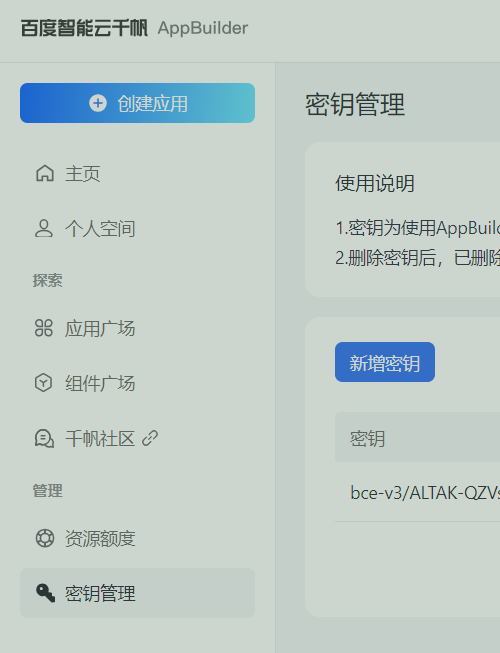
  
  ### 3 [创建知识库](https://console.bce.baidu.com/ai_apaas/personalSpace/knowledgeBase)
  
  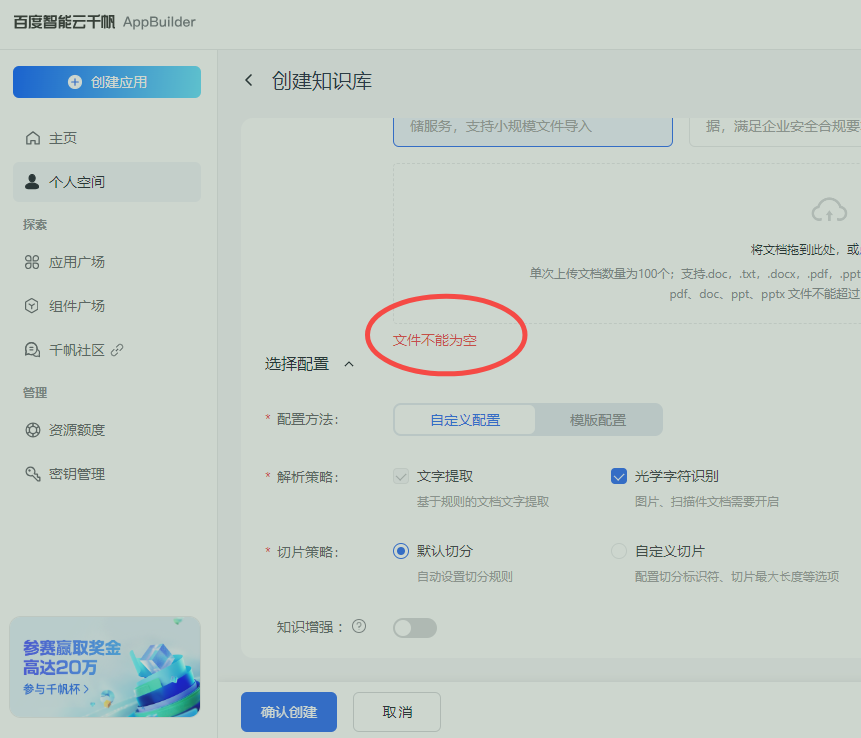
  
  *需要先随便上传一个文件，不然不能创建知识库。最后再删除其。全部选项默认。*
  
  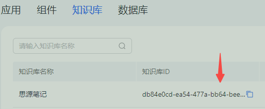
  
  把ID填入工具箱的配置中。
  
  ### 4 [创建应用](https://console.bce.baidu.com/ai_apaas/personalSpace/app)
  
  
  
  *1 必须添加刚才创建的知识库。*
  
  *2 可以选`文心一言4.0`*
  
  *3 发布，发布才有ID*
  
  
  
  发布得到ID，把ID填入工具箱的配置中。
  
  到这里已经可以使用了。
  

---

## 拍照闪念

  
  收集闪念到当天dailynote，支持从`相机`与`图库`插入图片。
  
  ### 按钮说明
  
  |  📸相机拍照           |  🖼️从图库从选择   |
  |---|---|
  | 📩插入到dailynote    |  🗑️清理列表，清理输入框    |
  | 🔄同步数据到云端      |                         |
  
  
  ### 移动端中使用
  
  *开发初衷：`拍照闪念`功能，主要是为了在移动端，快速插入灵感。*
  
  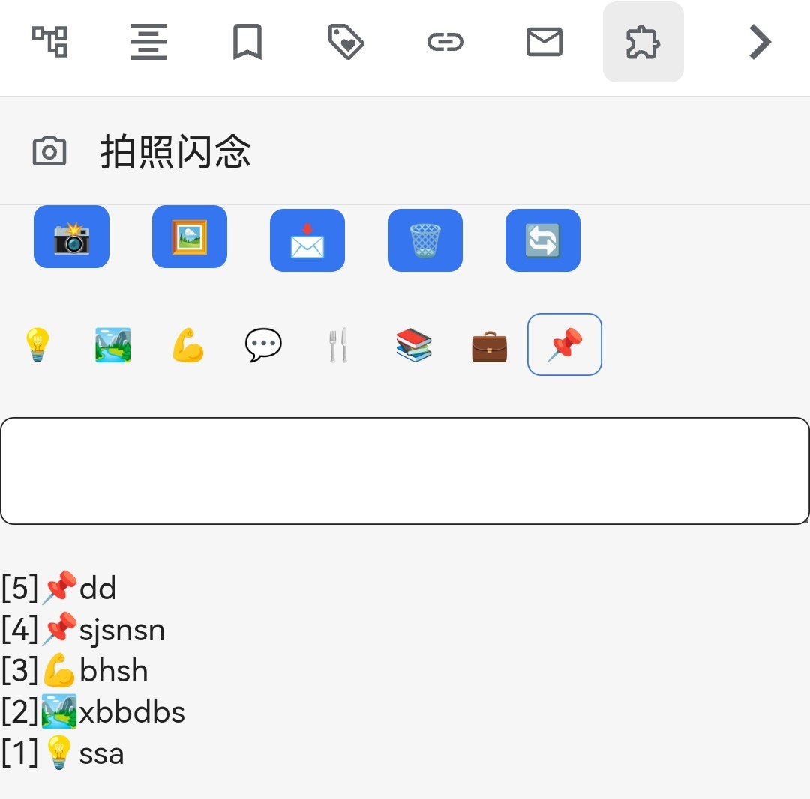
  
  
  > [打不开图片请看这里](https://gitee.com/TokenzQdBN/sy-tomato-plugin/blob/main/README_zh_CN.md)
  
  ### 记录的信息，可能的类别
  
  | 场所: 🏞️：段落块   | 健康: 💪：段落块   | 社交: 💬：段落块   |
  |---|---|---|
  |生活: 🍴：段落块    |学习: 📚：段落块    | 工作: 💼：段落块   |
  |任务: 📌：**任务块**    |  |  |
  
  ### `规避云端同步冲突`选项
  
  *默认关闭，需要到配置中开启。*
  
  
  
  原因：桌面端与移动端都同时写入Dailynote会引起内容不一致，导致同步时发生冲突。
  
  所以要避免两个端同时修改同一个文件。
  
  开启此选项后，移动端将不直接写入dailynote，而是写入dailynote的子文件中。
  
  桌面端通过迂回的方式，合并子文件到dailynote。
  
  移动端的作用更加倾向于记录，不直接修改dailynote。
  
  桌面端则是整理维护，可以直接修改dailynote。
  
  > 优点：无同步冲突。
  
  > 优点：手机端，桌面端通过云端功能同步，无需开启伺服。比如：设置->云端->S3->aliyun OSS。
  
  > 缺点：在手机端的dailynote不能直接看到新插入的闪念，需要桌面端来合并。
  
  ### 可以配合下面介绍的`文本转引用`功能。快速插入引用。
  
  
  
  > [打不开图片请看这里](https://gitee.com/TokenzQdBN/sy-tomato-plugin/blob/main/README_zh_CN.md)
  
  ### 桌面端使用
  
  *在看<small>大</small>电影时，也可以快速`ctrl+Q`打开小窗，记录灵感。*
  
  如果无法使用，建议检查`快捷键`是否有**冲突**。
  
  
  
  `ctrl+q` 可以从应用外唤出。
  `escape` 关闭。
  `shift+enter` 软换行。
  `enter` 写入当天的dailynote。
  
  > [打不开图片请看这里](https://gitee.com/TokenzQdBN/sy-tomato-plugin/blob/main/README_zh_CN.md)

---

## 文本转引用

  
  > [打不开图片请看这里](https://gitee.com/TokenzQdBN/sy-tomato-plugin/blob/main/README_zh_CN.md)
  
  
  
  ### `@@`：精确转换：
  
  例如内容块中有：`aaa @@bb ccc` 回车会会转为 `aaa bb ccc` 其中`bb`是引用。
  
  可以用`@`隔离引用与其他文本。比如：`EE@@ABC@FF`，将转为`EEABCFF`其中`ABC`是引用。
  
  ### 模糊转换1：

  如果你有文档 ABC 与 AEF, '@@@A' 将展开为： 'ABC AEF'。

  ### 模糊转换2：`ctrl+4`
  
  **创建文件时可将文件制卡，可以给文件加上拼音属性。需要在配置中打开。**

---

## 闪卡优先级

  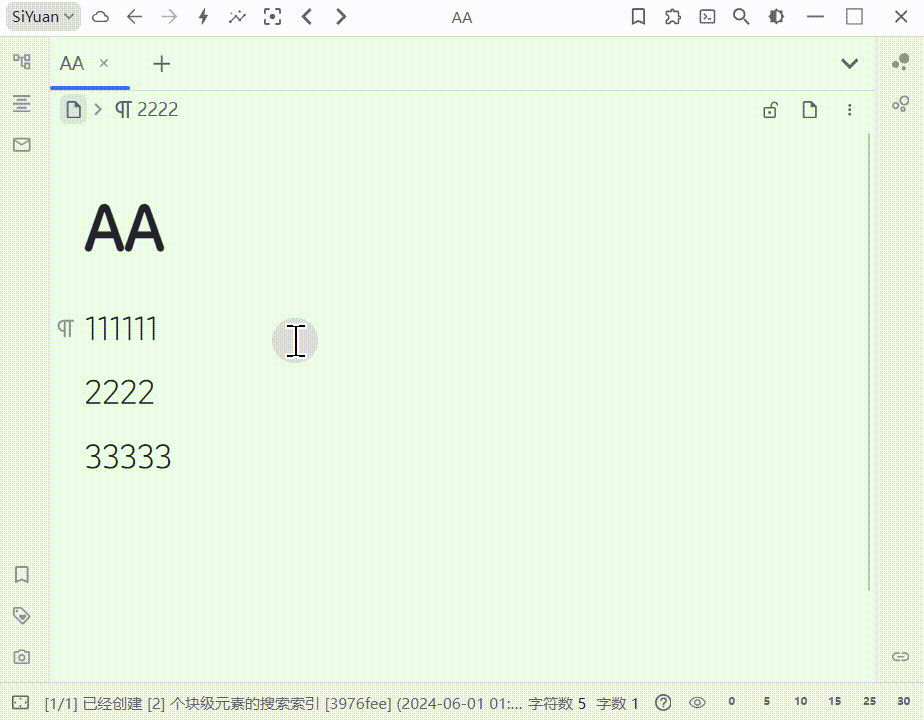
  
  对闪卡设置优先级，优先级**数值大**的**优先**复习。
  
  同级之间每次复习，都会打乱顺序。
  
  设置后，直接用`alt+0`复习即可。
  
  插件已在复习前，根据优先级对闪卡排序。
  
  优先级保存在闪卡的自定义属性`card-priority`中。
  
  可手动调整，也可通过闪卡下方按钮调整。
  
  优先级范围 0 ~ 100，默认优先级为50，没设置过优先级的闪卡也默认为50.
  
  **推迟：**
  
  推迟的闪卡，加入书签，方便查看所有推迟的闪卡。
  
  闪卡推迟后，显示到期时间。时间到，自动恢复正常状态。
  
  推迟的闪卡，不会推送给用户复习。
  
  还可鼠标悬浮于优先级上，查看复习次数。
  
  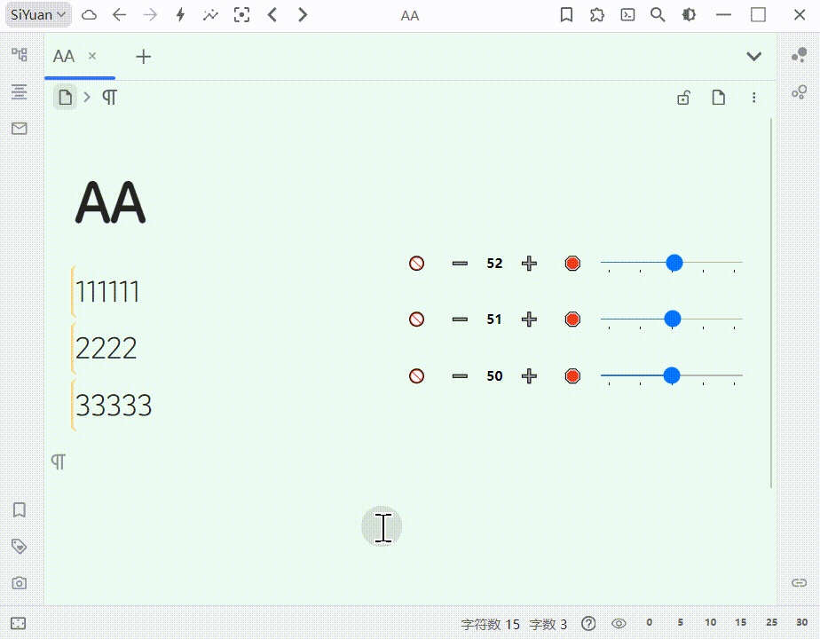
  
  > [打不开图片请看这里](https://gitee.com/TokenzQdBN/sy-tomato-plugin/blob/main/README_zh_CN.md)

---

## 复习时添加删除`闪卡`按钮

  请在配置中开启`闪卡工具`。
  
  **复习界面快捷键：**
  
  取消制卡：`ctrl+9`
  跳过卡：`ctrl+8`
  改优先级：`ctrl+;`
  
  
  
  **列表制卡：**
  
  `ctrl+1` 创建列表，并制卡。在列表卡中，再次使用`ctrl+1`则为取消制卡。
  
  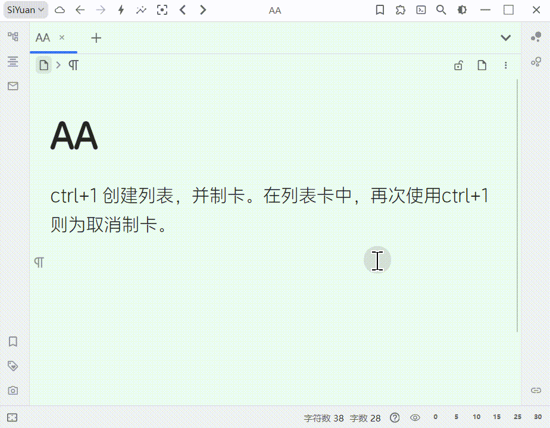
  
  > [打不开图片请看这里](https://gitee.com/TokenzQdBN/sy-tomato-plugin/blob/main/README_zh_CN.md)
  
  **文档所有卡，取消制卡**
  
  

---

## 数据库反链

将反链插入数据库。`F9`

---

## 底部反链

  
  
  加入类似 `logseq` 的底部反链区。对于列表/大纲块，我们可以看到其上级与下级。上级从面包屑看，下级从内容中看。
  
  ### 概念栏/引用栏
  
  **`层级概念`：文件名如 `AA|BB|CC`，它的底部反链，最上面的双链栏，可能会出现：`AA*  AA|BB*  AA|BB|CC*` 如果有。（图中红圈）**
  
  **`相关概念`：双链栏除了`层级概念`的其他双链。**
  
  *下面演示`层级概念深林`开启了`文本转引用`功能。*
  
  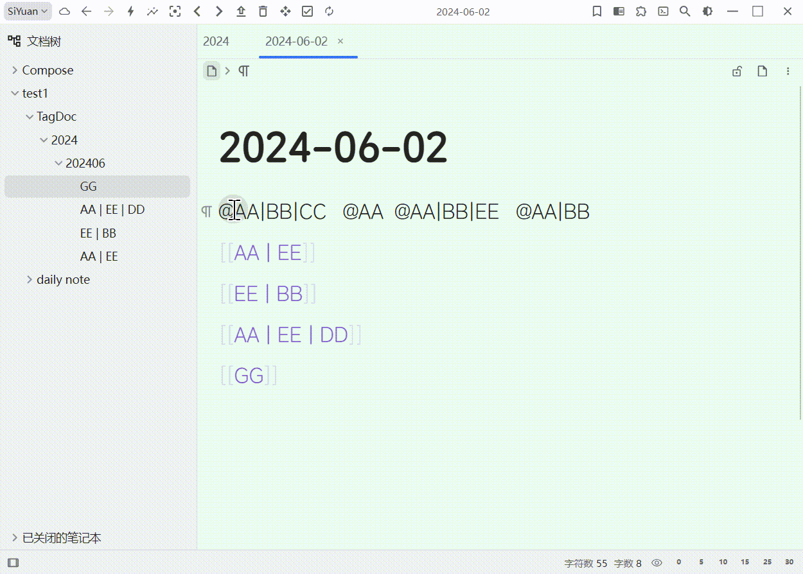
  
  **反链区工具：可以编辑、拖动、一键复制、一键移动、实时搜索过滤、标识某个反链是否属于当前文档等……**
  
  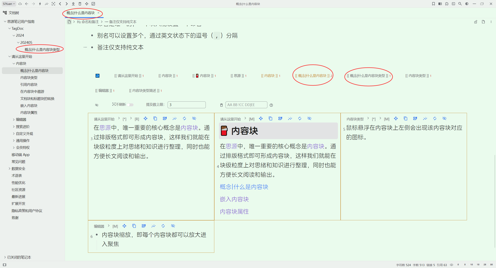
  
  > 在文档的右键菜单中，可以针对此文档，启用与禁用底部反链。
  
  > [打不开图片请看这里](https://gitee.com/TokenzQdBN/sy-tomato-plugin/blob/main/README_zh_CN.md)
  
  ### 将不相关的内容置于底部
  
  
  
  ### 底部反链::搜索语法
  
  *输入框内支持多个`关键词`实时搜索。*
  
  **输入的`关键词`之间用`空格`隔开，如果`关键词`前面加上`感叹号`，代表反链中不能有此`关键词`。**
  
  **比如：** `小明 小红 !老王 !王总`，将搜索到包含`小明`，并且包含`小红`，但不包含`老王`，也不包含`王总`的反链。
  
  **多个`关键词`之间如果用`|`切分，代表这些`关键词`只要有一个出现即可。**
  
  **比如：** `小明 小红|如花 !老王 !王总`，将搜索到包含`小明`，并且至少包含`小红`、`如花`中一个，但不包含`老王`，也不包含`王总`的反链。
  
  **比如：** `小明 老炮 小红|如花|秋菊 !老王 !王总`，将搜索到包含`小明`与`老炮`，并且至少包含`小红`、`如花`、`秋菊`中一个，但不包含`老王`，也不包含`王总`的反链。
  
  > `底部反链区` 默认关闭，请从配置中打开。

---

## 双向互链

  
  
  ### 用法1
  
  
  
  使用`Alt+F1`选择第一个块，在第二个块处使用`Alt+F2`，这样就创建好了两个互相跳转的链接。

  `alt+shift+F1` 可以修复双向链接。比如把内容剪切后再粘贴，块ID发生了变化，可以用`alt+shift+F1`修复。

  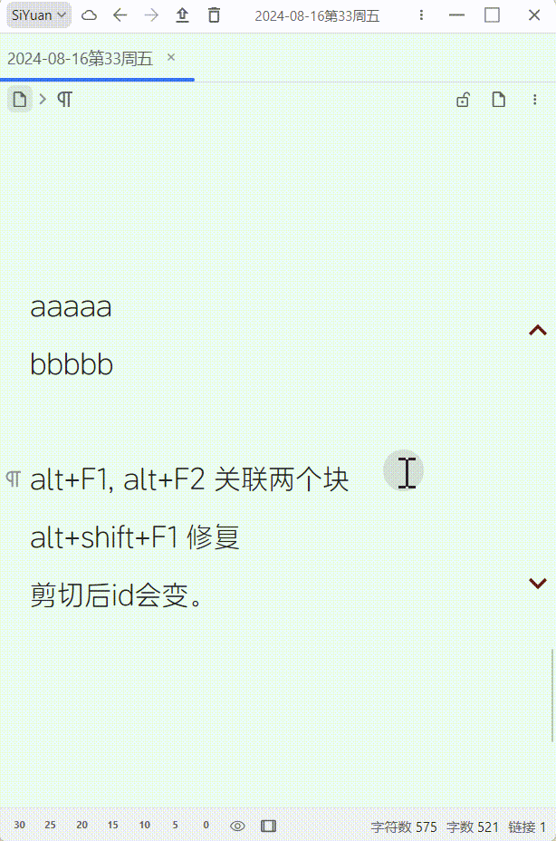

  ### 用法2

  在A块ctrl+f1，然后在B块ctrl+f2，将在创建B块下方创建A块的`嵌入块`。

  ### 用法3

  链接到底部: `Alt+F3`

  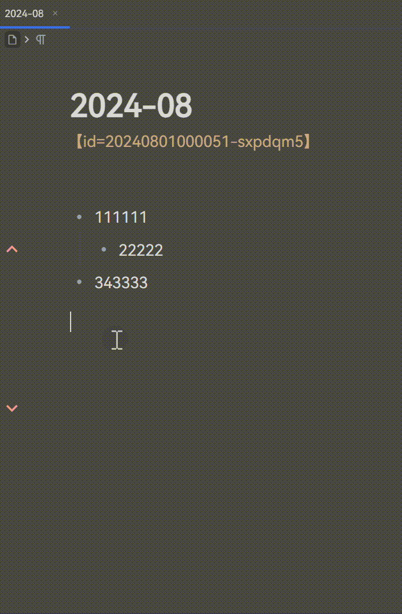

  ### 用法4
  
  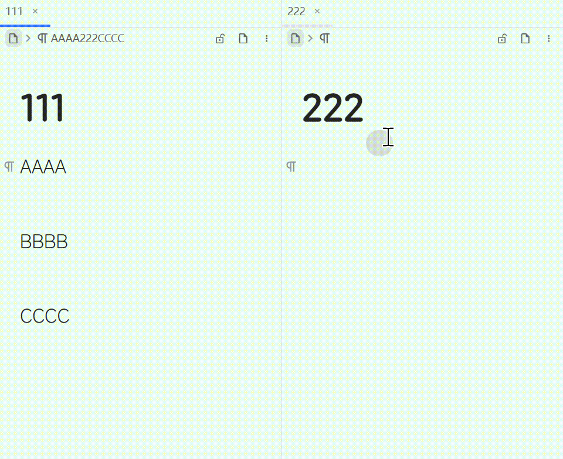
  
  快捷键：`Alt+/` 或者菜单中选择对应功能。
  
  > **提示** 可以多行选择，但需要使用快捷键：`Alt+/`。

  > [打不开图片请看这里](https://gitee.com/TokenzQdBN/sy-tomato-plugin/blob/main/README_zh_CN.md)

---

## 内容提醒 `ctrl+3`

  
  *给一个内容块设置个提醒日期吧！*
  
  **光标定位好要选择的`内容块`，右键菜单中选择`设置提醒`**
  
  
  
  *设置时间好，会自动加上一个时间书签。可到书签面板查看。*
  
  *提醒后，会自动删除书签*
  
  > 提醒功能默认关闭，请到配置里打开。
  
  **连续两次按下`ctrl+3`为复制光标所在的块ID**
  
  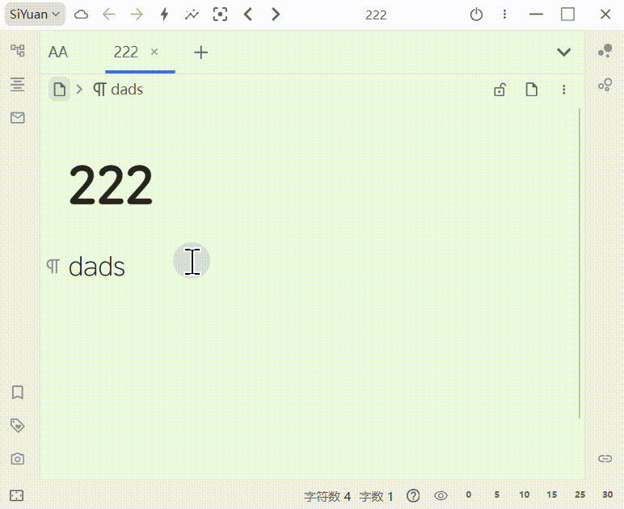
  
  > [打不开图片请看这里](https://gitee.com/TokenzQdBN/sy-tomato-plugin/blob/main/README_zh_CN.md)

---

## 阅读点

  
  > [打不开图片请看这里](https://gitee.com/TokenzQdBN/sy-tomato-plugin/blob/main/README_zh_CN.md)
  
  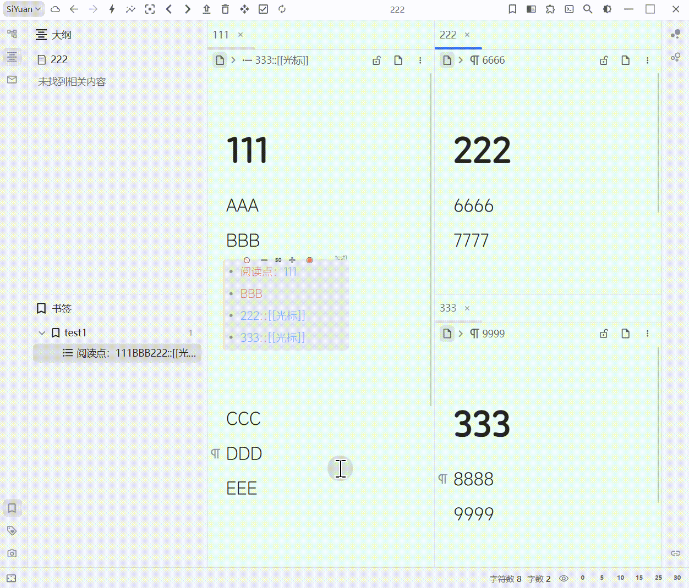
  
  *阅读点也就是一个文档上次阅读到的位置，我们把它记录到`书签`里面，并且自动删除当前文件内的其他`书签`。以保持本文件内只有一个`书签`。*
  
  **光标定位好要选择的`内容块`，使用右键菜单，也可以直接 `Ctrl+2`。**
  
  **之后要查看`书签`可以，可以直接看`书签面板`。也可以点击右上角的 `阅读点` (ctrl+4) 图标，查看更加详细的信息。**
  
  
  
  > 阅读点全新升级：保留之前的书签功能外，另加入闪卡，利用了闪卡的计划能力，同时也保存了当时看过了哪些文件。
  
  > **注意** `阅读点` 图标的分组方式与书签面板的不一样。

---

## 清理失效`闪卡` ctrl+shift+z

  
  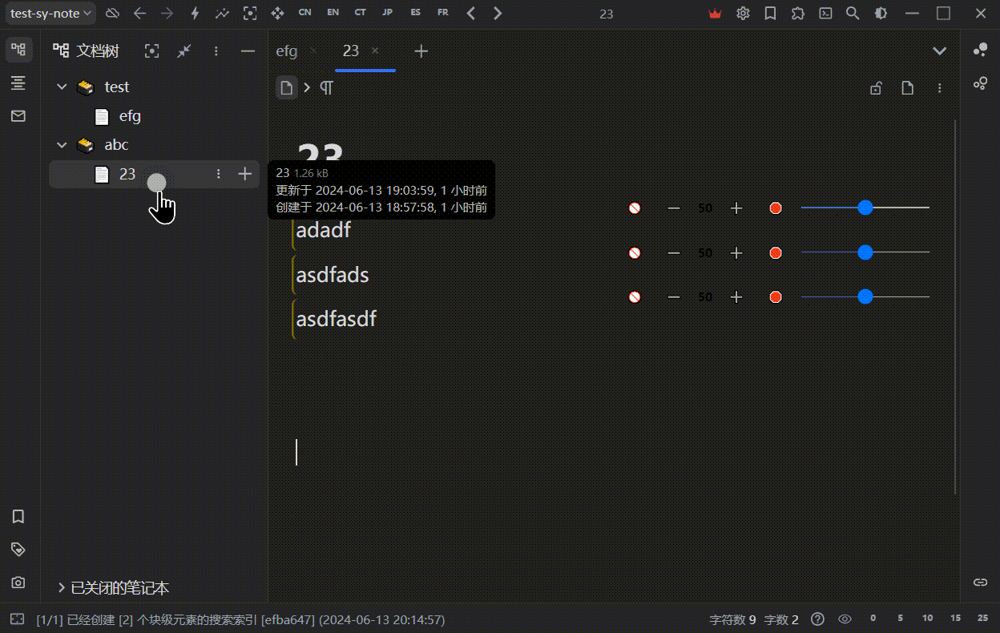
  
  *如果闪卡所在的内容被我们删除了，这样的失效闪卡还存在于磁盘中。我们可以对其进行删除。*
  
  **打开命令面板，选择 `清理所有失效闪卡`**
  
  > **注意** 使用前做好备份！
  
  > [打不开图片请看这里](https://gitee.com/TokenzQdBN/sy-tomato-plugin/blob/main/README_zh_CN.md)

---

## 超长内容操作

  
  > [打不开图片请看这里](https://gitee.com/TokenzQdBN/sy-tomato-plugin/blob/main/README_zh_CN.md)
  
  *超长内容的复制、移动、删除操作让我发疯！这里我使用了一种朴素的方法来对付这样的操作！*
  
  **移动操作**
  
  
  
  *假设有`文档1`与`文档2`，在`文档1`中，用`aacc1`、`aacc2`两行包裹住要移动的内容，然后在`文档2`的某个位置插入`aacc3`，最后打开`命令面板`，选择`批量移动大量连续内容`即可*
  
  **此移动操作会连同`闪卡`一起转移，不会改变`闪卡`的复习现状。而简单的`ctrl+c,v`会让涉及到的`闪卡`失效。**
  
  > **注意** `aacc1`、`aacc2`、`aacc3` 前后不能有空格，不然插件找不到。
  
  
  
  **复制操作**
  
  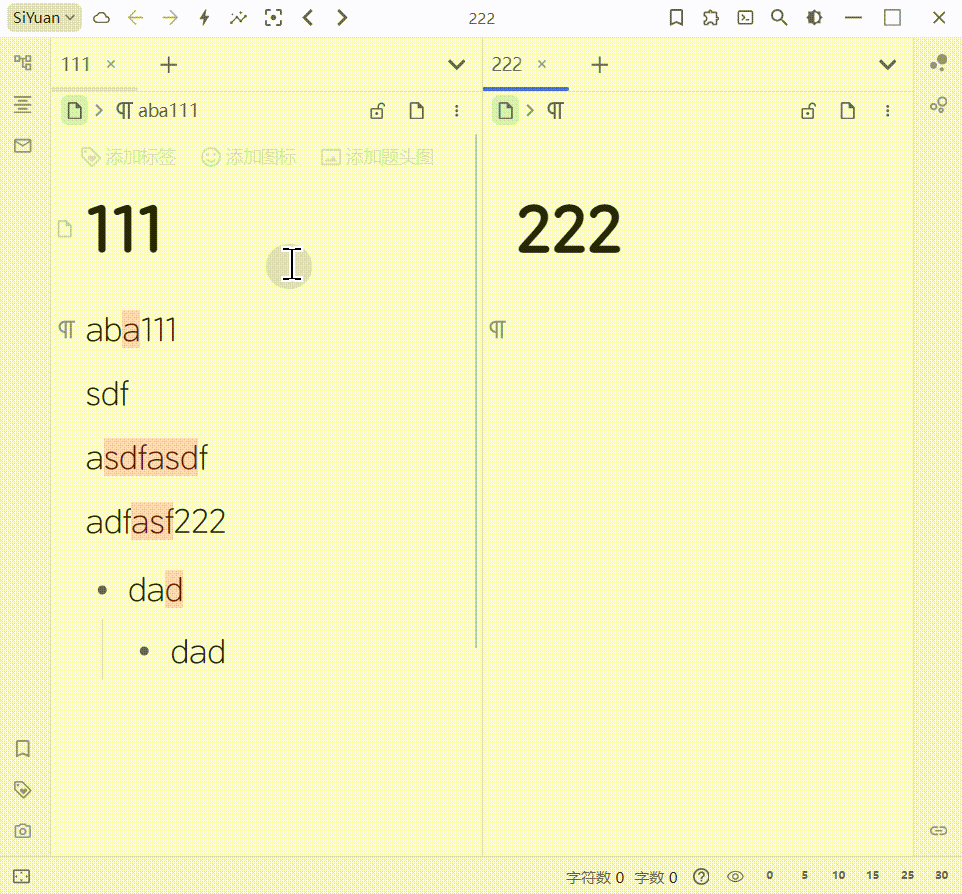
  
  **删除操作**
  
  类似移动操作，但要选择删除命令，且无需写`aacc3`。

---

## 图片遮挡（闪卡图片挖空）

  
  
  
  **用法:** 对图片块，右键->插件->添加图片遮挡层。
  
  本功能默认关闭，需要先在`番茄工具箱`的配置中开启`图片遮挡`功能。
  
  **想看原图，可以双击图片中无遮挡层的区域。**
  
  **支持图片缩放。老版本做的遮挡，需要重新编辑一下，才会支持缩放。**
  
  **支持鼠标拖拽画矩形。**
  
  > 为什么做此功能？
  >
  > 我的需求与 [siyuan-plugin-flash-enhance](https://github.com/zxhd863943427/siyuan-plugin-flash-enhance) 的`图片遮挡`功能有点差异。希望图片一直处于遮挡，无论是否在闪卡复习中，除非鼠标悬浮其上，才会撤销遮挡。对于一个图片有多个遮挡层的情况，只有鼠标悬浮的那个遮挡层才消失。（部分代码参考了：[siyuan-plugin-flash-enhance](https://github.com/zxhd863943427/siyuan-plugin-flash-enhance)，感谢：[zxhd863943427](https://github.com/zxhd863943427)）
  
  > [打不开图片请看这里](https://gitee.com/TokenzQdBN/sy-tomato-plugin/blob/main/README_zh_CN.md)

---

## 移动内容到 daily note

  
  `Ctrl+6`
  
  
  
  将光标所在的内容块、选中的所有内容，移动到今日的daily note底部。
  
  支持右键与快捷键，默认关闭，请从配置打开。
  
  > 仅仅移动选中的单行或者多行内容，或者未选中时，光标所在块。
  
  > [打不开图片请看这里](https://gitee.com/TokenzQdBN/sy-tomato-plugin/blob/main/README_zh_CN.md)

---

## 删除已经勾选的任务（命令面板） `shift+alt+u`

  
  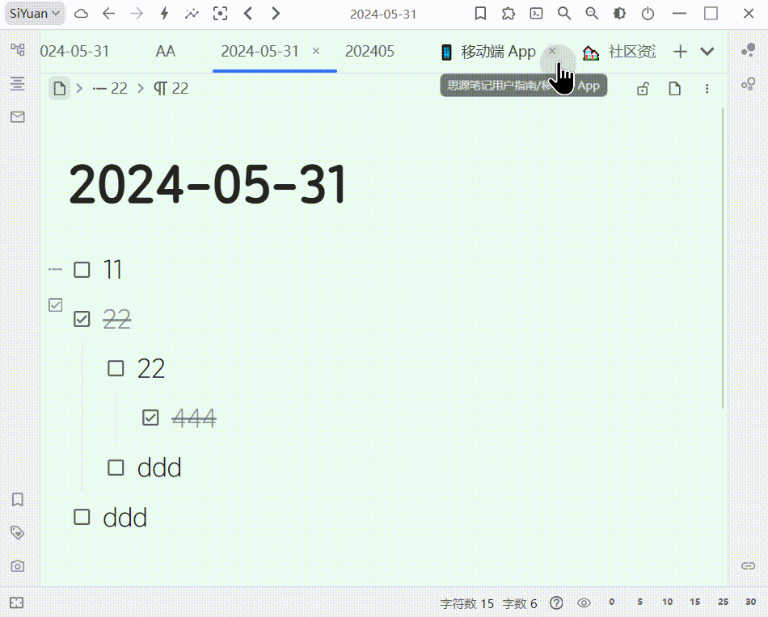
  
  右键菜单，默认开启，删除当前文档内已经勾选的任务。
  
  > [打不开图片请看这里](https://gitee.com/TokenzQdBN/sy-tomato-plugin/blob/main/README_zh_CN.md)
  
  ## 取消任务的勾选（命令面板） `shift+alt+d`
  
  右键菜单，默认开启，取消当前文档中所有任务的勾选。

---

## 顶部工具条

  
  
  
  ### 打开上一个/下一个 daily note（配置：移动内容到 daily note）
  
  **最后2个图标，代表上一个、下一个 daily note**
  
  `alt+w`、`alt+q`
  
  > 默认关闭，请从配置打开："移动内容到 daily note" 功能。
  
  ### 打开闪卡（配置：开启toolbar按钮）`alt+0`
  
  **那个闪电图标就是** 默认打开。
  
  ### 全局定位文档（配置：开启toolbar按钮）`alt+1`
  
  自动打开文档树，折叠文档，定位文档。只有目标文档的路径是展开的，其他文档路径是折叠的。
  
  ### 刷新虚拟引用（配置：开启toolbar按钮）`F5`
  
  默认打开。
  
  ### 各国语言切换按钮（配置：开启toolbar按钮）
  
  默认关闭。
  
  > 以上的快捷键有些与官方的冲突，需要先去掉官方的才能生效。或者修改本插件的快捷键。

---

## 人工智能（流式 stream）

  
  支持：*文心一言、deepseek、moonshot、思源配置里的OpenAI。*
  
  先到配置中写入keys：
  
  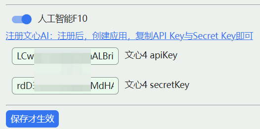
  
  然后对`选中文本`，或者`光标所在文本`，使用快捷键：`Alt+Shift+S`
  
  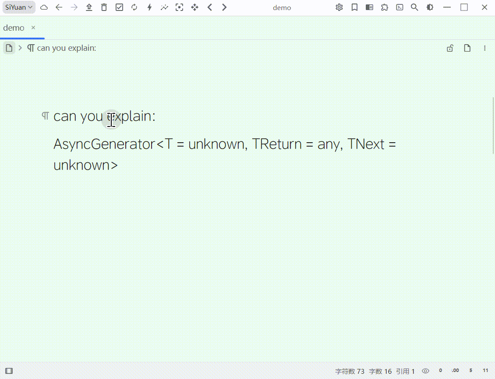
  
  > [打不开图片请看这里](https://gitee.com/TokenzQdBN/sy-tomato-plugin/blob/main/README_zh_CN.md)

---

## 复制多个块为图片

  
  

---

## 其他功能

### 静态反链

  
  可以被导出的底部反链。
  
  对于反链特别多的文件，用静态反链无压力。
  
  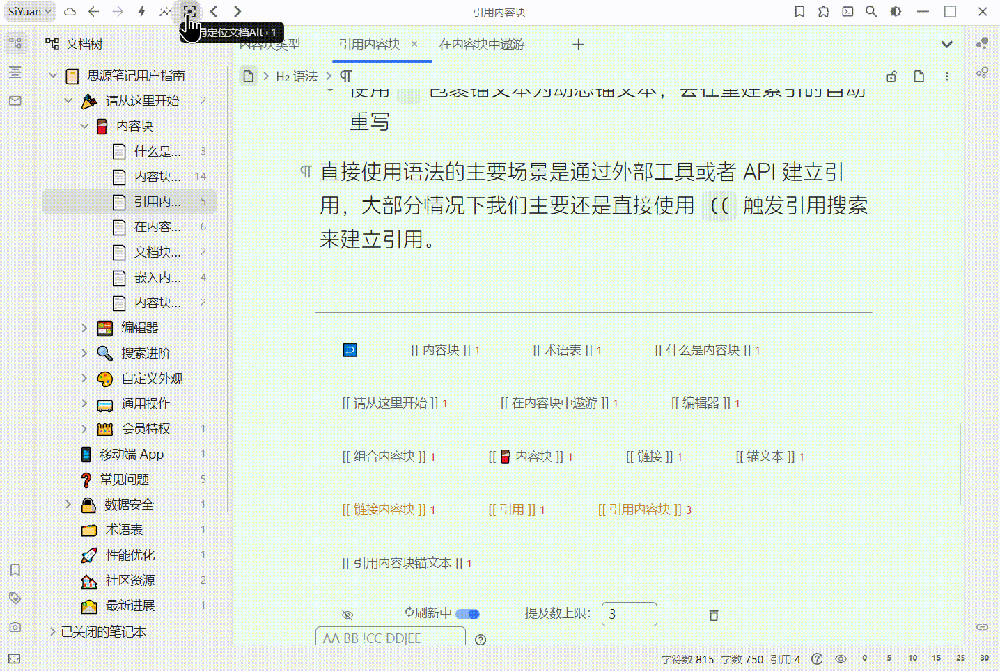
  
  > [打不开图片请看这里](https://gitee.com/TokenzQdBN/sy-tomato-plugin/blob/main/README_zh_CN.md)

### 移动文档内容到另一文档

  
  

### 文档合并

  
  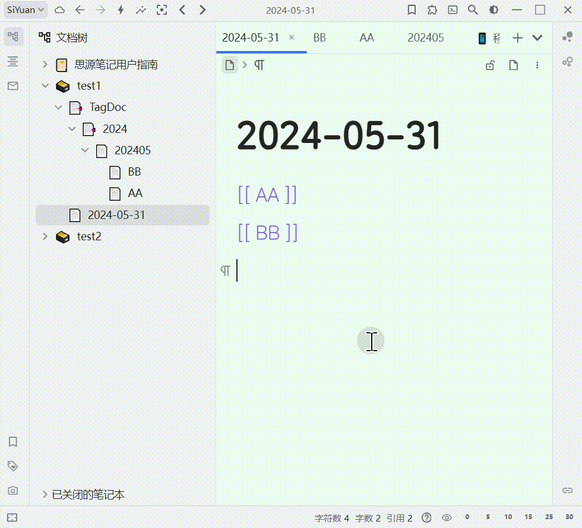
  
  在`文档B`中某处右键->插件->快捷菜单，找`合并文档`按钮。
  
  把填入的`文档A`内容移动到右键处，把`文档A`的引用、属性到转移到`文档B`。
  
  把`文档A`删除。
  
  > [打不开图片请看这里](https://gitee.com/TokenzQdBN/sy-tomato-plugin/blob/main/README_zh_CN.md)

### 选中文本转引用

  
  快捷键：`F3`
  
  
  
  > [打不开图片请看这里](https://gitee.com/TokenzQdBN/sy-tomato-plugin/blob/main/README_zh_CN.md)

### 一键加书签

  
  一键加书签 `ctrl+f1`
  一键删当前文档所有书签 `ctrl+f2`
  
  
  
  > [打不开图片请看这里](https://gitee.com/TokenzQdBN/sy-tomato-plugin/blob/main/README_zh_CN.md)

### 跳转到剪贴板中的块ID

  
  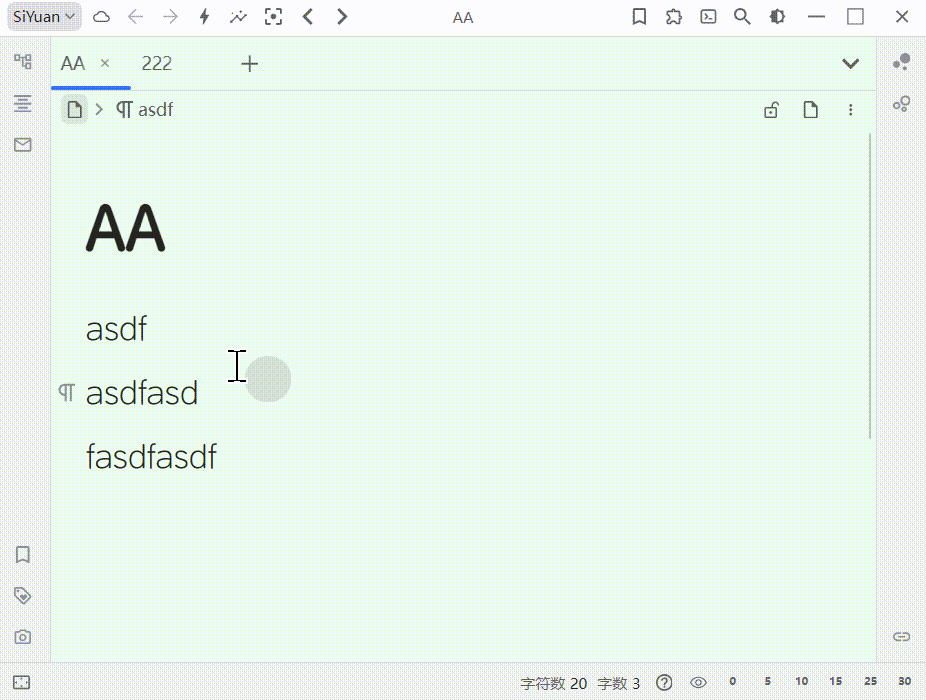
  
  > [打不开图片请看这里](https://gitee.com/TokenzQdBN/sy-tomato-plugin/blob/main/README_zh_CN.md)

### 选中文字与其拼音加入文档的别名，方便用拼音搜索。Ctrl+shift+y

  
  默认关闭，需要从配置中打开。然后在选中文字，在右键菜单中使用。
  
  

### 整理Assets下的图片、视频、音频。

  
  *如果assets下的文件太多，是个地雷，不小心点到得卡半天。我个人会整理这些文件，为年月的文件夹结构。*
  
  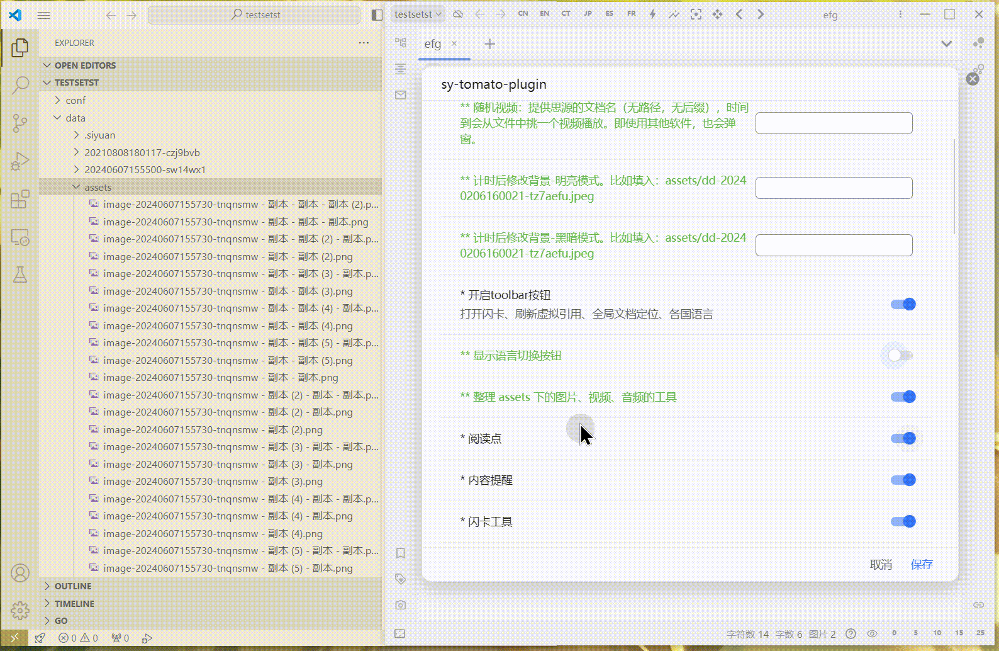

### 创建空白xmind文件

  
  *需要先安装 xmind*
  
  
  
  > [打不开图片请看这里](https://gitee.com/TokenzQdBN/sy-tomato-plugin/blob/main/README_zh_CN.md)

### 让内容变得模糊 Alt+Shift+D

  
  第一次按下为附加模糊效果，第二按下为取消模糊效果。
  
  

### 内容制表 Alt+Shift+T

  
  多行用‘|’分割的列，可以制表。
  
  

### 段落块只读功能 `Alt+Shift+L`

### 定位指定块的反链，以及虚拟正链 `Alt+Shift+A`

### 删除内容以及闪卡 `ctrl+alt+d`

同时删除选中的、光标处的内容块，文档，以及对应的闪卡。光标在标题处，则是删除文档。如果是删除文档，则先删除其内部的闪卡。

### 点击块右上角引用数，定位所有反链。

  
  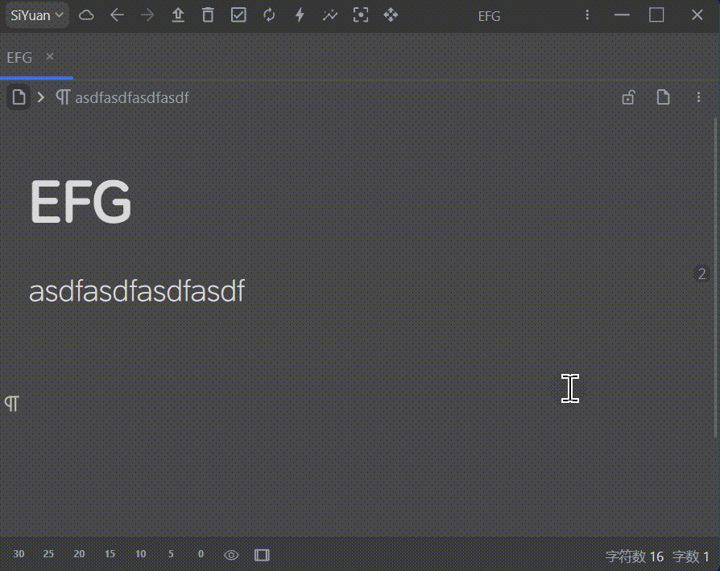

# 鸣谢

  
感谢所有慷慨的支持者，你们的打赏对我的插件开发意义重大。

* 2024-11 [爱发电用户_35865](https://afdian.com/u/35865882c7e411ed8b3b5254001e7c00)
* 2024-11 [Tisamn](https://afdian.com/u/cef7f2e42a0f11efb03952540025c377)
* 2024-10 `Nnf`
* 2024-10 `**强`
* 2024-10 Sonetto
* 2024-09 星愿无辰
* 2024-09 [Tisamn](https://afdian.com/u/cef7f2e42a0f11efb03952540025c377)
* 2024-08 `edapan`
* 2024-08 `**生`
* 2024-08 [虚青海](https://afdian.com/a/xqh042)
* 2024-08 `duanduan`
* 2024-07 `凭风引`
* 2024-07 `**岚`
* 2024-06 [虚青海](https://afdian.com/a/xqh042)
* 2024-06 [爱发电用户_jykN](https://afdian.com/u/20b38264295811efb0695254001e7c00)
* 2024-06 `雨`
* 2024-06 `*超`
* 2024-06 `**峰`
* 2024-06 [固元膏v](https://afdian.com/u/d1fe450cbf4b11ea9ffa52540025c377)
* 2024-05 `*超`
* 2024-05 `**瑞`
* 2024-05 `**瑞`
* 2024-05 `**刚`
* 2024-05 `*驰`
* 2024-05 [盐酸有点咸](https://afdian.com/u/379a287008a111efa3c552540025c377)
* 2024-04 `*江`
* 2024-04 [无糖](https://afdian.com/u/7eefa1207fe711ee971552540025c377)
* 2024-04 `典典`
* 2024-03 `**清`
* 2024-03 [JeffreyChen](https://afdian.com/a/JeffreyChen)
* 2024-03 `八面来风`
* 2024-03 `**清`
* 2024-03 `*理`
* 2024-02 `八面来风`
* 2024-02 `*5770`
* 2024-02 `**轩`
* 2024-02 `**航`
* 2024-02 `**航`
* 2024-02 `**龙`
* 2024-02 `**棉`
* 2024-01 [QQQOrange](https://afdian.com/u/2c73a3c6a1f011eeb98a52540025c377)
* 2024-01 `燃烬`
* 2024-01 `*舟`
* 2024-01 `*元`
* 2024-01 [赐我一胖](https://afdian.com/u/74d98cf66f0711eda8ca52540025c377)
* 2023-12 [爱发电用户_WGH7](https://afdian.com/u/ceefbee4a48111ee983f5254001e7c00)
* 2023-12 [爱发电用户_Pv38](https://afdian.com/u/3911fecaa3ad11ee8fa95254001e7c00)
* 2023-12 [赐我一胖](https://afdian.com/u/74d98cf66f0711eda8ca52540025c377)
* 2023-12 [QQQOrange](https://afdian.com/u/2c73a3c6a1f011eeb98a52540025c377)
* 2023-12 [没头脑和不高兴](https://afdian.com/u/25e08b1eb1a511edbb3d5254001e7c00)
* 2023-12 [爱发电用户_EbBe](https://afdian.com/u/d11e3c741bc711ee95eb52540025c377)
* 2023-12 [爱发电用户_b2864](https://afdian.com/u/b286492496af11eea38752540025c377)

# 打赏、鼓励、催更 🎉

 

