[English](https://github.com/IAliceBobI/sy-tomato-plugin/blob/main/README.md)

# 番茄工具箱

> [我猜下面的图九成九是裂开了😢，看这里吧！](https://gitee.com/TokenzQdBN/sy-tomato-plugin/blob/main/README_zh_CN.md)

## 配置

  
  
  > [打赏鼓励，请到这里](https://gitee.com/TokenzQdBN/sy-tomato-plugin/blob/main/README_zh_CN.md#bug%E5%8F%8D%E9%A6%88%E5%BB%BA%E8%AE%AE)
  
  > [打不开图片请看这里](https://gitee.com/TokenzQdBN/sy-tomato-plugin/blob/main/README_zh_CN.md)

---

## `右键菜单`与`图标菜单`

  
  

---

## 番茄钟

### 状态栏番茄钟

  *快速测试*可以加入`0.01`分钟，例如配置：`0.01,5,10,15,25,30`
  
  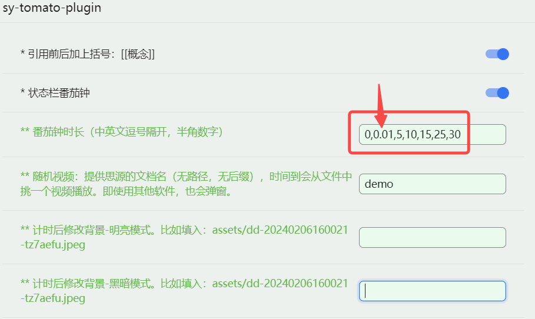
  
  
  
  > [打不开图片请看这里](https://gitee.com/TokenzQdBN/sy-tomato-plugin/blob/main/README_zh_CN.md)
  
  * **0**：取消计时
  * **5**：计时五分钟
  * ……
  * **25**：计时二十五分钟
  
  *支持自定义时长。*
  *重启思源后，也会继续上次的计时。*
  *能查看剩余时间。*

### 计时结束后，播放随机内容

  从一个指定文件中随机读取内容，并在计时结束后展示。
  
  演示中的文件为`demo`，里面的内容包括，文本、图片、IFrame链接、视频，还可以有音频等。
  
  *`Escape`可关闭弹出窗口*
  
  

### 计时后改变背景图

  需要给明亮与黑暗两种模式都找一个图。
  
  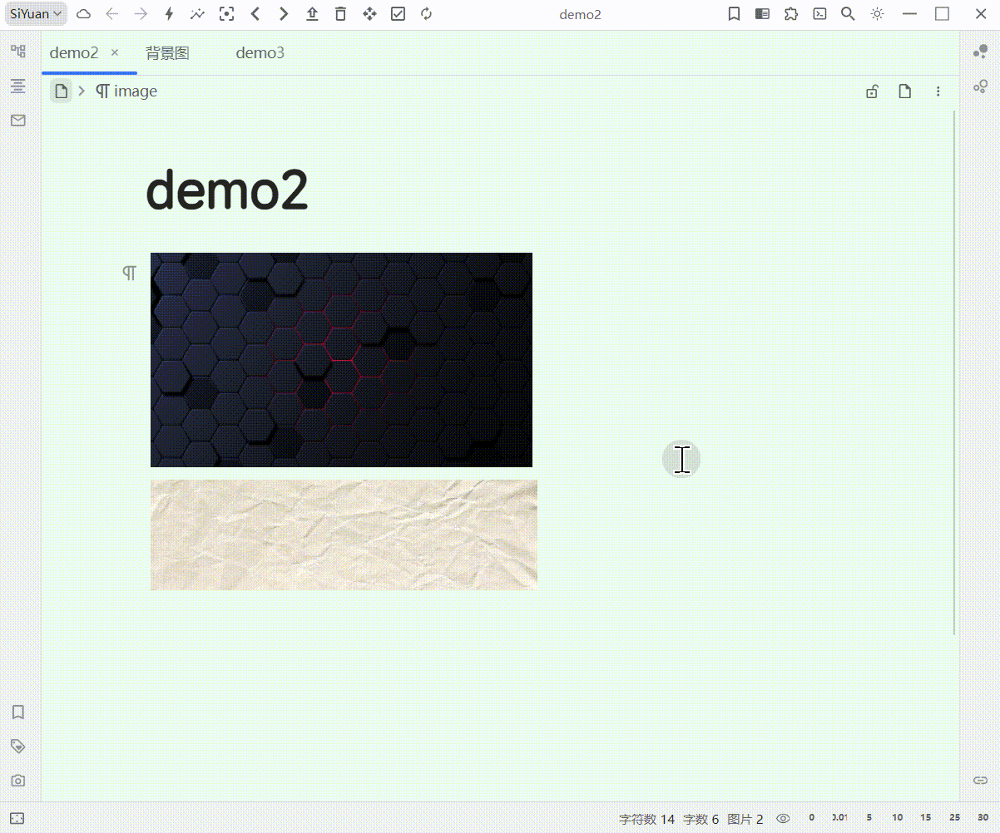
  
  > [打不开图片请看这里](https://gitee.com/TokenzQdBN/sy-tomato-plugin/blob/main/README_zh_CN.md)

---

## AI知识库问答 `Ctrl+Shift+S`

  针对思源文档，进行提问，答案中包含出处的引用。
  
  基于百度千帆知识库。
  
  > [打不开图片请看这里](https://gitee.com/TokenzQdBN/sy-tomato-plugin/blob/main/README_zh_CN.md)

  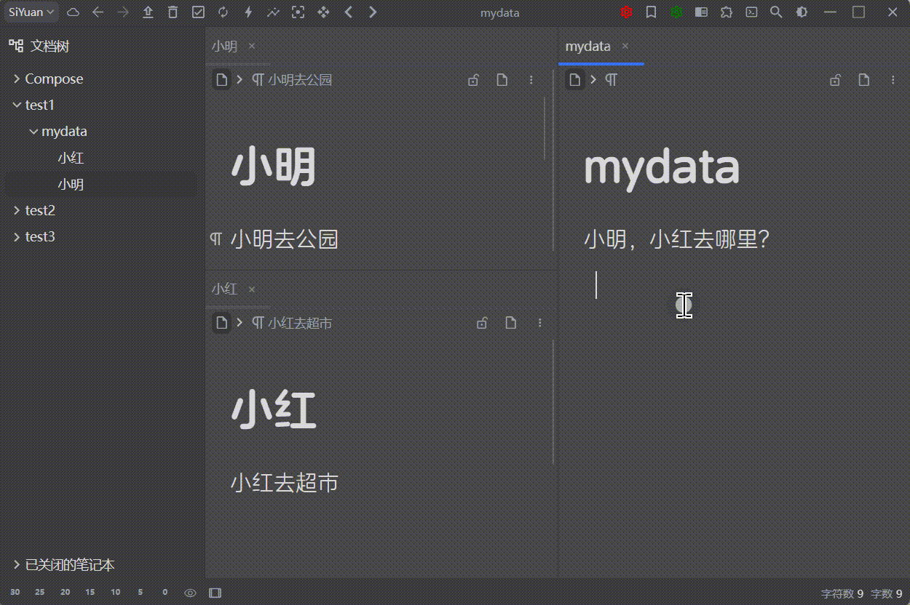
  
  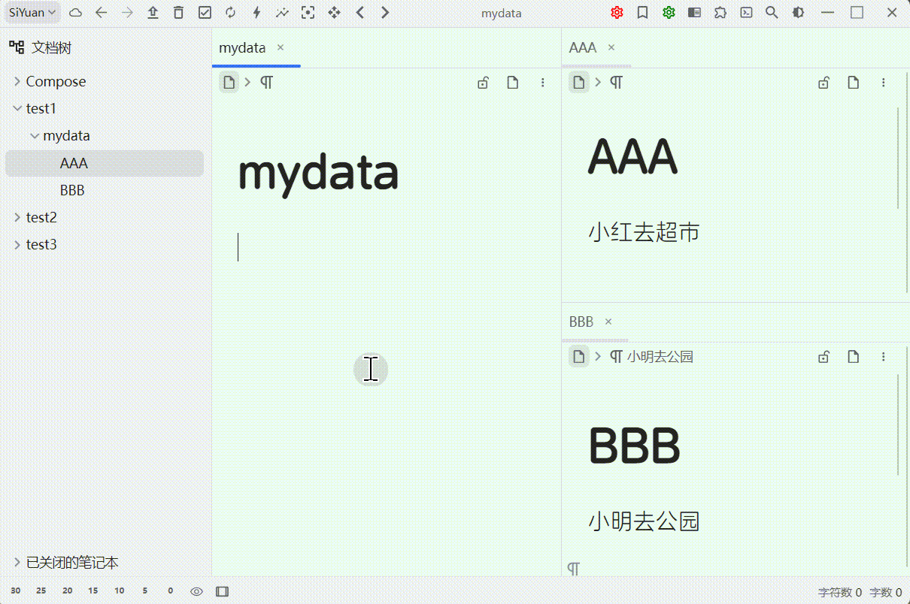
  
  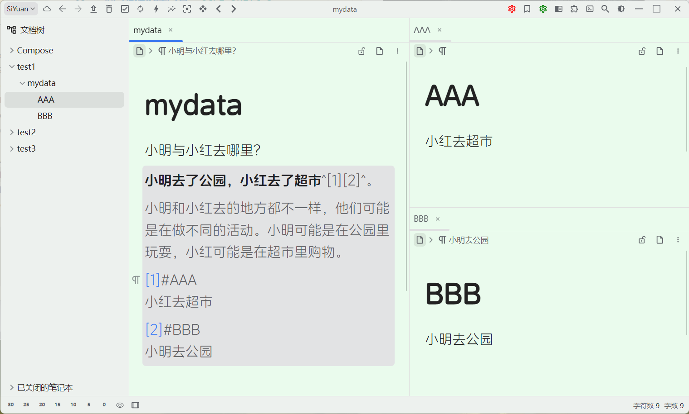
  
  ### 1 打开配置
  
  
  
  ### 2 [创建密钥](https://console.bce.baidu.com/ai_apaas/secretKey)
  
  根据配置中的链接，注册账户，创建密钥，把密钥填入工具箱的配置中。
  
  
  
  ### 3 [创建知识库](https://console.bce.baidu.com/ai_apaas/personalSpace/knowledgeBase)
  
  
  
  *需要先随便上传一个文件，不然不能创建知识库。最后再删除其。全部选项默认。*
  
  
  
  把ID填入工具箱的配置中。
  
  ### 4 [创建应用](https://console.bce.baidu.com/ai_apaas/personalSpace/app)
  
  
  
  *1 必须添加刚才创建的知识库。*
  
  *2 可以选`文心一言4.0`*
  
  *3 发布，发布才有ID*
  
  
  
  发布得到ID，把ID填入工具箱的配置中。
  
  到这里已经可以使用了。
  

---

## 拍照闪念

  
  收集闪念到当天dailynote，支持从`相机`与`图库`插入图片。
  
  ### 按钮说明
  
  |  📸相机拍照           |  🖼️从图库从选择   |
  |---|---|
  | 📩插入到dailynote    |  🗑️清理列表，清理输入框    |
  | 🔄同步数据到云端      |                         |
  
  
  ### 移动端中使用
  
  *开发初衷：`拍照闪念`功能，主要是为了在移动端，快速插入灵感。*
  
  
  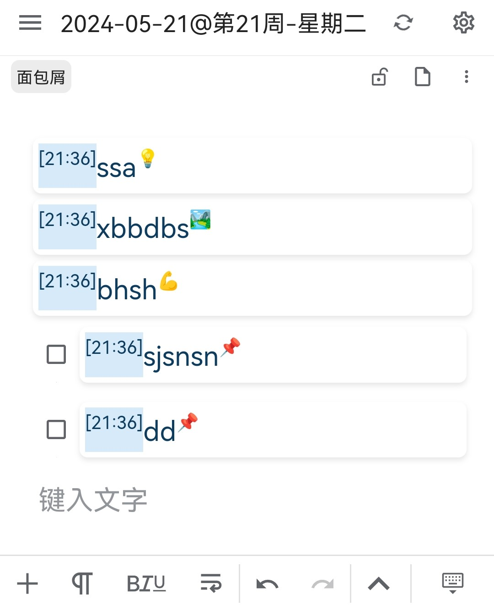
  
  > [打不开图片请看这里](https://gitee.com/TokenzQdBN/sy-tomato-plugin/blob/main/README_zh_CN.md)
  
  ### 记录的信息，可能的类别
  
  | 场所: 🏞️：段落块   | 健康: 💪：段落块   | 社交: 💬：段落块   |
  |---|---|---|
  |生活: 🍴：段落块    |学习: 📚：段落块    | 工作: 💼：段落块   |
  |任务: 📌：**任务块**    |  |  |
  
  ### `规避云端同步冲突`选项
  
  *默认关闭，需要到配置中开启。*
  
  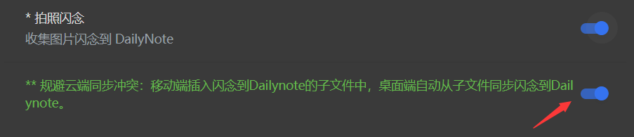
  
  原因：桌面端与移动端都同时写入Dailynote会引起内容不一致，导致同步时发生冲突。
  
  所以要避免两个端同时修改同一个文件。
  
  开启此选项后，移动端将不直接写入dailynote，而是写入dailynote的子文件中。
  
  桌面端通过迂回的方式，合并子文件到dailynote。
  
  移动端的作用更加倾向于记录，不直接修改dailynote。
  
  桌面端则是整理维护，可以直接修改dailynote。
  
  > 优点：无同步冲突。
  
  > 优点：手机端，桌面端通过云端功能同步，无需开启伺服。比如：设置->云端->S3->aliyun OSS。
  
  > 缺点：在手机端的dailynote不能直接看到新插入的闪念，需要桌面端来合并。
  
  ### 可以配合下面介绍的`文本转引用`功能。快速插入引用。
  
  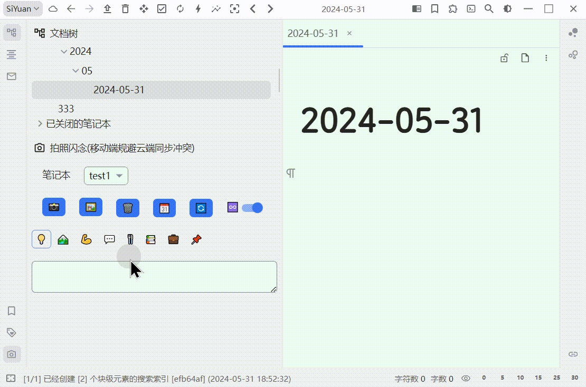
  
  > [打不开图片请看这里](https://gitee.com/TokenzQdBN/sy-tomato-plugin/blob/main/README_zh_CN.md)
  
  ### 桌面端使用
  
  *在看<small>大</small>电影时，也可以快速`ctrl+Q`打开小窗，记录灵感。*
  
  如果无法使用，建议检查`快捷键`是否有**冲突**。
  
  
  
  `ctrl+q` 可以从应用外唤出。
  `escape` 关闭。
  `shift+enter` 软换行。
  `enter` 写入当天的dailynote。
  
  > [打不开图片请看这里](https://gitee.com/TokenzQdBN/sy-tomato-plugin/blob/main/README_zh_CN.md)

---

## 文本转引用

  
  > [打不开图片请看这里](https://gitee.com/TokenzQdBN/sy-tomato-plugin/blob/main/README_zh_CN.md)
  
  
  
  ### `@@`：精确转换：
  
  例如内容块中有：`aaa @@bb ccc` 回车会会转为 `aaa bb ccc` 其中`bb`是引用。
  
  可以用`@`隔离引用与其他文本。比如：`EE@@ABC@FF`，将转为`EEABCFF`其中`ABC`是引用。
  
  ### 模糊转换：`ctrl+4`
  
  **创建文件时可将文件制卡，可以给文件加上拼音属性。需要在配置中打开。**

---

## 闪卡优先级

  
  
  对闪卡设置优先级，优先级**数值大**的**优先**复习。
  
  同级之间每次复习，都会打乱顺序。
  
  设置后，直接用`alt+0`复习即可。
  
  插件已在复习前，根据优先级对闪卡排序。
  
  优先级保存在闪卡的自定义属性`card-priority`中。
  
  可手动调整，也可通过闪卡下方按钮调整。
  
  优先级范围 0 ~ 100，默认优先级为50，没设置过优先级的闪卡也默认为50.
  
  **推迟：**
  
  推迟的闪卡，加入书签，方便查看所有推迟的闪卡。
  
  闪卡推迟后，显示到期时间。时间到，自动恢复正常状态。
  
  推迟的闪卡，不会推送给用户复习。
  
  还可鼠标悬浮于优先级上，查看复习次数。
  
  
  
  > [打不开图片请看这里](https://gitee.com/TokenzQdBN/sy-tomato-plugin/blob/main/README_zh_CN.md)

---

## 复习时添加删除`闪卡`按钮

  请在配置中开启`闪卡工具`。
  
  **复习界面快捷键：**
  
  取消制卡：`ctrl+9`
  跳过卡：`ctrl+8`
  改优先级：`ctrl+;`
  
  
  
  **列表制卡：**
  
  `ctrl+1` 创建列表，并制卡。在列表卡中，再次使用`ctrl+1`则为取消制卡。
  
  
  
  > [打不开图片请看这里](https://gitee.com/TokenzQdBN/sy-tomato-plugin/blob/main/README_zh_CN.md)
  
  **文档所有卡，取消制卡**
  
  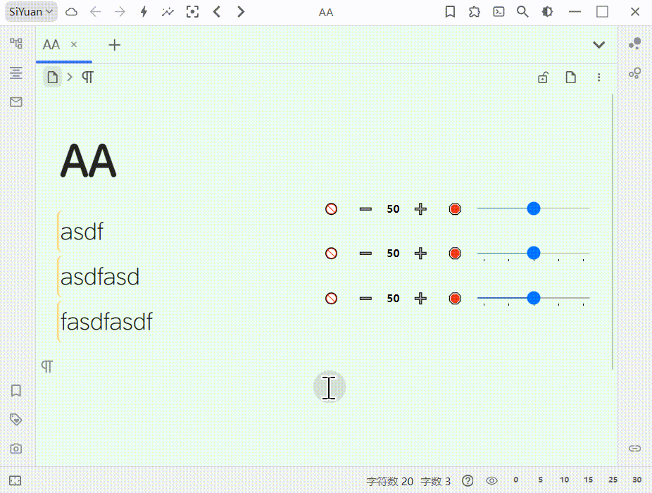

---

## 数据库反链

将反链插入数据库。

---

## 底部反链

  
  
  加入类似 `logseq` 的底部反链区。对于列表/大纲块，我们可以看到其上级与下级。上级从面包屑看，下级从内容中看。
  
  ### 概念栏/引用栏
  
  **`层级概念`：文件名如 `AA|BB|CC`，它的底部反链，最上面的双链栏，可能会出现：`AA*  AA|BB*  AA|BB|CC*` 如果有。（图中红圈）**
  
  **`相关概念`：双链栏除了`层级概念`的其他双链。**
  
  *下面演示`层级概念深林`开启了`文本转引用`功能。*
  
  
  
  **反链区工具：可以编辑、拖动、一键复制、一键移动、实时搜索过滤、标识某个反链是否属于当前文档等……**
  
  
  
  > 在文档的右键菜单中，可以针对此文档，启用与禁用底部反链。
  
  > [打不开图片请看这里](https://gitee.com/TokenzQdBN/sy-tomato-plugin/blob/main/README_zh_CN.md)
  
  ### 将不相关的内容置于底部
  
  
  
  ### 底部反链::搜索语法
  
  *输入框内支持多个`关键词`实时搜索。*
  
  **输入的`关键词`之间用`空格`隔开，如果`关键词`前面加上`感叹号`，代表反链中不能有此`关键词`。**
  
  **比如：** `小明 小红 !老王 !王总`，将搜索到包含`小明`，并且包含`小红`，但不包含`老王`，也不包含`王总`的反链。
  
  **多个`关键词`之间如果用`|`切分，代表这些`关键词`只要有一个出现即可。**
  
  **比如：** `小明 小红|如花 !老王 !王总`，将搜索到包含`小明`，并且至少包含`小红`、`如花`中一个，但不包含`老王`，也不包含`王总`的反链。
  
  **比如：** `小明 老炮 小红|如花|秋菊 !老王 !王总`，将搜索到包含`小明`与`老炮`，并且至少包含`小红`、`如花`、`秋菊`中一个，但不包含`老王`，也不包含`王总`的反链。
  
  > `底部反链区` 默认关闭，请从配置中打开。

---

## 双向互链

  
  
  ### 用法1
  
  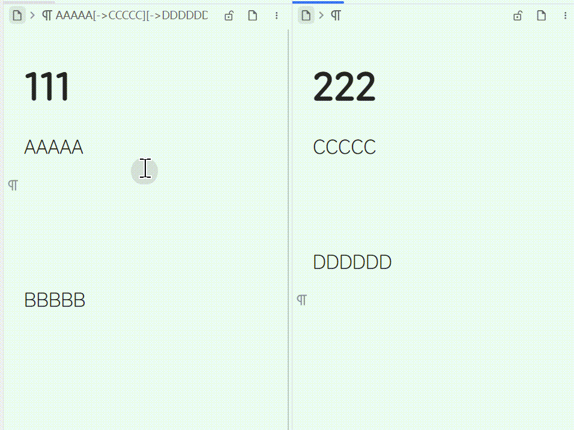
  
  使用`Alt+F1`选择第一个块，在第二个块处使用`Alt+F2`，这样就创建好了两个互相跳转的链接。

  `alt+shift+F1` 可以修复双向链接。比如把内容剪切后再粘贴，块ID发生了变化，可以用`alt+shift+F1`修复。

  

  ### 用法2

  链接到底部: `Alt+F3`

  

  ### 用法3
  
  
  
  快捷键：`Alt+/` 或者菜单中选择对应功能。
  
  > **提示** 可以多行选择，但需要使用快捷键：`Alt+/`。

  > [打不开图片请看这里](https://gitee.com/TokenzQdBN/sy-tomato-plugin/blob/main/README_zh_CN.md)

---

## 内容提醒 `ctrl+3`

  
  *给一个内容块设置个提醒日期吧！*
  
  **光标定位好要选择的`内容块`，右键菜单中选择`设置提醒`**
  
  
  
  *设置时间好，会自动加上一个时间书签。可到书签面板查看。*
  
  *提醒后，会自动删除书签*
  
  > 提醒功能默认关闭，请到配置里打开。
  
  **连续两次按下`ctrl+3`为复制光标所在的块ID**
  
  
  
  > [打不开图片请看这里](https://gitee.com/TokenzQdBN/sy-tomato-plugin/blob/main/README_zh_CN.md)

---

## 阅读点

  
  > [打不开图片请看这里](https://gitee.com/TokenzQdBN/sy-tomato-plugin/blob/main/README_zh_CN.md)
  
  
  
  *阅读点也就是一个文档上次阅读到的位置，我们把它记录到`书签`里面，并且自动删除当前文件内的其他`书签`。以保持本文件内只有一个`书签`。*
  
  **光标定位好要选择的`内容块`，使用右键菜单，也可以直接 `Ctrl+2`。**
  
  **之后要查看`书签`可以，可以直接看`书签面板`。也可以点击右上角的 `阅读点` (ctrl+4) 图标，查看更加详细的信息。**
  
  
  
  > 阅读点全新升级：保留之前的书签功能外，另加入闪卡，利用了闪卡的计划能力，同时也保存了当时看过了哪些文件。
  
  > **注意** `阅读点` 图标的分组方式与书签面板的不一样。

---

## 清理失效`闪卡` ctrl+shift+z

  
  
  
  *如果闪卡所在的内容被我们删除了，这样的失效闪卡还存在于磁盘中。我们可以对其进行删除。*
  
  **打开命令面板，选择 `清理所有失效闪卡`**
  
  > **注意** 使用前做好备份！
  
  > [打不开图片请看这里](https://gitee.com/TokenzQdBN/sy-tomato-plugin/blob/main/README_zh_CN.md)

---

## 超长内容操作

  
  > [打不开图片请看这里](https://gitee.com/TokenzQdBN/sy-tomato-plugin/blob/main/README_zh_CN.md)
  
  *超长内容的复制、移动、删除操作让我发疯！这里我使用了一种朴素的方法来对付这样的操作！*
  
  **移动操作**
  
  
  
  *假设有`文档1`与`文档2`，在`文档1`中，用`aacc1`、`aacc2`两行包裹住要移动的内容，然后在`文档2`的某个位置插入`aacc3`，最后打开`命令面板`，选择`批量移动大量连续内容`即可*
  
  **此移动操作会连同`闪卡`一起转移，不会改变`闪卡`的复习现状。而简单的`ctrl+c,v`会让涉及到的`闪卡`失效。**
  
  > **注意** `aacc1`、`aacc2`、`aacc3` 前后不能有空格，不然插件找不到。
  
  
  
  **复制操作**
  
  
  
  **删除操作**
  
  类似移动操作，但要选择删除命令，且无需写`aacc3`。

---

## 图片遮挡（闪卡图片挖空）

  
  
  
  **用法:** 对图片块，右键->插件->添加图片遮挡层。
  
  本功能默认关闭，需要先在`番茄工具箱`的配置中开启`图片遮挡`功能。
  
  **想看原图，可以双击图片中无遮挡层的区域。**
  
  **支持图片缩放。老版本做的遮挡，需要重新编辑一下，才会支持缩放。**
  
  **支持鼠标拖拽画矩形。**
  
  > 为什么做此功能？
  >
  > 我的需求与 [siyuan-plugin-flash-enhance](https://github.com/zxhd863943427/siyuan-plugin-flash-enhance) 的`图片遮挡`功能有点差异。希望图片一直处于遮挡，无论是否在闪卡复习中，除非鼠标悬浮其上，才会撤销遮挡。对于一个图片有多个遮挡层的情况，只有鼠标悬浮的那个遮挡层才消失。（部分代码参考了：[siyuan-plugin-flash-enhance](https://github.com/zxhd863943427/siyuan-plugin-flash-enhance)，感谢：[zxhd863943427](https://github.com/zxhd863943427)）
  
  > [打不开图片请看这里](https://gitee.com/TokenzQdBN/sy-tomato-plugin/blob/main/README_zh_CN.md)

---

## 移动内容到 daily note

  
  `Ctrl+6`
  
  
  
  将光标所在的内容块、选中的所有内容，移动到今日的daily note底部。
  
  支持右键与快捷键，默认关闭，请从配置打开。
  
  > 仅仅移动选中的单行或者多行内容，或者未选中时，光标所在块。
  
  > [打不开图片请看这里](https://gitee.com/TokenzQdBN/sy-tomato-plugin/blob/main/README_zh_CN.md)

---

## 删除已经勾选的任务（命令面板） `shift+alt+u`

  
  
  
  右键菜单，默认开启，删除当前文档内已经勾选的任务。
  
  > [打不开图片请看这里](https://gitee.com/TokenzQdBN/sy-tomato-plugin/blob/main/README_zh_CN.md)
  
  ## 取消任务的勾选（命令面板） `shift+alt+d`
  
  右键菜单，默认开启，取消当前文档中所有任务的勾选。

---

## 顶部工具条

  
  
  
  ### 打开上一个/下一个 daily note（配置：移动内容到 daily note）
  
  **最后2个图标，代表上一个、下一个 daily note**
  
  `alt+w`、`alt+q`
  
  > 默认关闭，请从配置打开："移动内容到 daily note" 功能。
  
  ### 打开闪卡（配置：开启toolbar按钮）`alt+0`
  
  **那个闪电图标就是** 默认打开。
  
  ### 全局定位文档（配置：开启toolbar按钮）`alt+1`
  
  自动打开文档树，折叠文档，定位文档。只有目标文档的路径是展开的，其他文档路径是折叠的。
  
  ### 刷新虚拟引用（配置：开启toolbar按钮）`F5`
  
  默认打开。
  
  ### 各国语言切换按钮（配置：开启toolbar按钮）
  
  默认关闭。
  
  > 以上的快捷键有些与官方的冲突，需要先去掉官方的才能生效。或者修改本插件的快捷键。

---

## 人工智能（流式 stream）

  
  支持：*文心一言、deepseek、moonshot、思源配置里的OpenAI。*
  
  先到配置中写入keys：
  
  
  
  然后对`选中文本`，或者`光标所在文本`，使用快捷键：`Alt+Shift+S`
  
  
  
  > [打不开图片请看这里](https://gitee.com/TokenzQdBN/sy-tomato-plugin/blob/main/README_zh_CN.md)

---

## 复制多个块为图片

  
  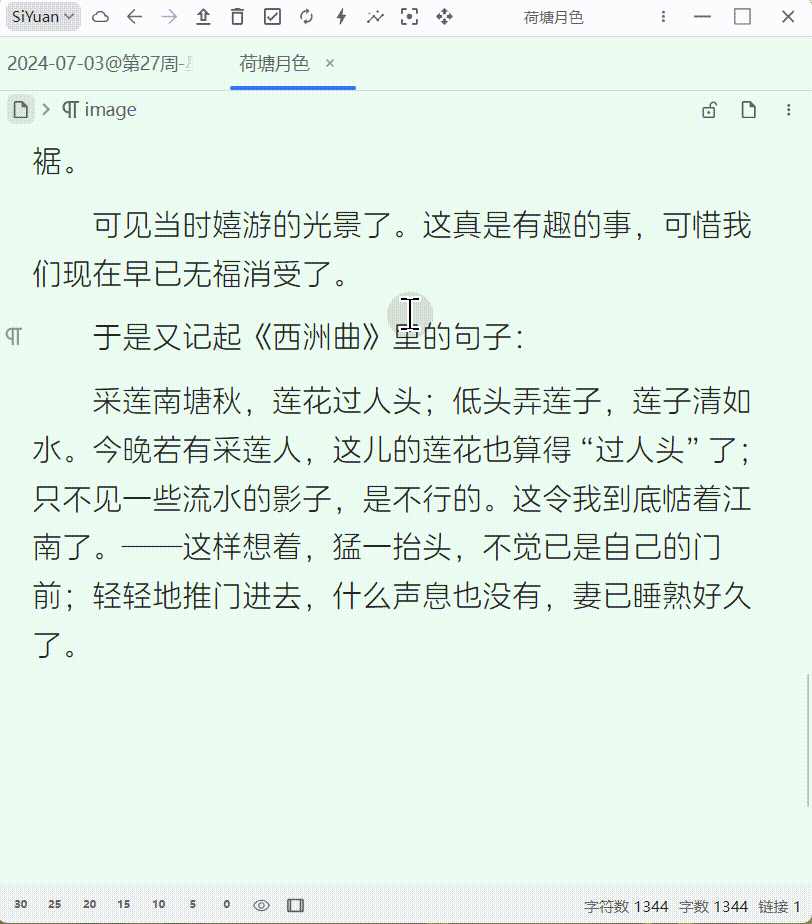

---

## 其他功能

### 静态反链

  
  可以被导出的底部反链。
  
  对于反链特别多的文件，用静态反链无压力。
  
  
  
  > [打不开图片请看这里](https://gitee.com/TokenzQdBN/sy-tomato-plugin/blob/main/README_zh_CN.md)

### 移动文档内容到另一文档

  
  

### 文档合并

  
  
  
  在`文档B`中某处右键->插件->快捷菜单，找`合并文档`按钮。
  
  把填入的`文档A`内容移动到右键处，把`文档A`的引用、属性到转移到`文档B`。
  
  把`文档A`删除。
  
  > [打不开图片请看这里](https://gitee.com/TokenzQdBN/sy-tomato-plugin/blob/main/README_zh_CN.md)

### 选中文本转引用

  
  快捷键：`F3`
  
  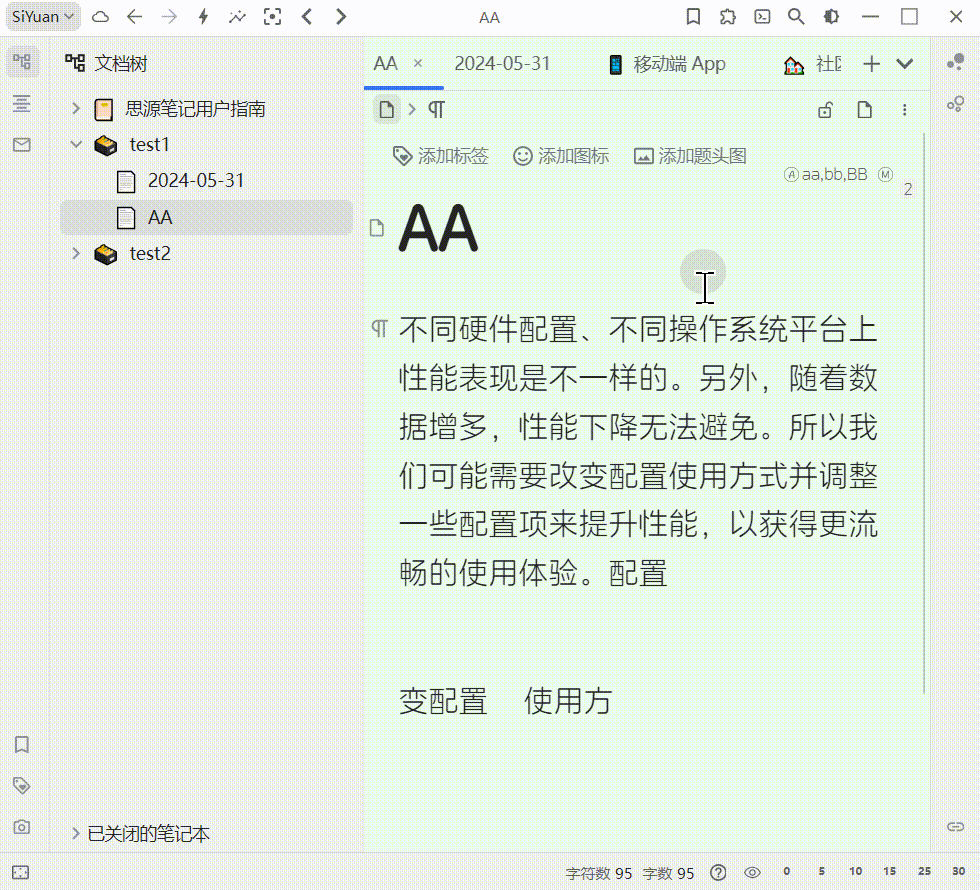
  
  > [打不开图片请看这里](https://gitee.com/TokenzQdBN/sy-tomato-plugin/blob/main/README_zh_CN.md)

### 一键加书签

  
  一键加书签 `ctrl+f1`
  一键删当前文档所有书签 `ctrl+f2`
  
  
  
  > [打不开图片请看这里](https://gitee.com/TokenzQdBN/sy-tomato-plugin/blob/main/README_zh_CN.md)

### 跳转到剪贴板中的块ID

  
  
  
  > [打不开图片请看这里](https://gitee.com/TokenzQdBN/sy-tomato-plugin/blob/main/README_zh_CN.md)

### 选中文字与其拼音加入文档的别名，方便用拼音搜索。Ctrl+shift+y

  
  默认关闭，需要从配置中打开。然后在选中文字，在右键菜单中使用。
  
  

### 整理Assets下的图片、视频、音频。

  
  *如果assets下的文件太多，是个地雷，不小心点到得卡半天。我个人会整理这些文件，为年月的文件夹结构。*
  
  

### 创建空白xmind文件

  
  *需要先安装 xmind*
  
  
  
  > [打不开图片请看这里](https://gitee.com/TokenzQdBN/sy-tomato-plugin/blob/main/README_zh_CN.md)

### 让内容变得模糊 Alt+Shift+D

  
  第一次按下为附加模糊效果，第二按下为取消模糊效果。
  
  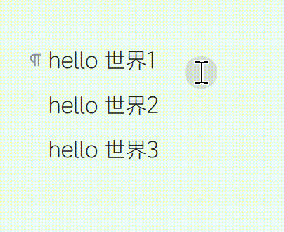

### 内容制表 Alt+Shift+T

  
  多行用‘|’分割的列，可以制表。
  
  

### 段落块只读功能 `Alt+Shift+L`

### 定位指定块的反链，以及虚拟正链 `Alt+Shift+A`

### 删除内容以及闪卡 `ctrl+alt+d`

同时删除选中的、光标处的内容块，文档，以及对应的闪卡。光标在标题处，则是删除文档。如果是删除文档，则先删除其内部的闪卡。

### 点击块右上角引用数，定位所有反链。

  
  

# 鸣谢

  
感谢所有慷慨的支持者，你们的打赏对我的插件开发意义重大。

* 2024-09 星愿无辰
* 2024-09 [Tisamn](https://afdian.com/u/cef7f2e42a0f11efb03952540025c377)
* 2024-08 `edapan`
* 2024-08 [虚青海](https://afdian.com/a/xqh042)
* 2024-08 `duanduan`
* 2024-07 `凭风引`
* 2024-07 `**岚`
* 2024-06 [虚青海](https://afdian.com/a/xqh042)
* 2024-06 [爱发电用户_jykN](https://afdian.com/u/20b38264295811efb0695254001e7c00)
* 2024-06 `雨`
* 2024-06 `*超`
* 2024-06 `**峰`
* 2024-06 [固元膏v](https://afdian.com/u/d1fe450cbf4b11ea9ffa52540025c377)
* 2024-05 `*超`
* 2024-05 `**瑞`
* 2024-05 `**瑞`
* 2024-05 `**刚`
* 2024-05 `*驰`
* 2024-05 [盐酸有点咸](https://afdian.com/u/379a287008a111efa3c552540025c377)
* 2024-04 `*江`
* 2024-04 [无糖](https://afdian.com/u/7eefa1207fe711ee971552540025c377)
* 2024-04 `典典`
* 2024-03 `**清`
* 2024-03 [JeffreyChen](https://afdian.com/a/JeffreyChen)
* 2024-03 `八面来风`
* 2024-03 `**清`
* 2024-03 `*理`
* 2024-02 `八面来风`
* 2024-02 `*5770`
* 2024-02 `**轩`
* 2024-02 `**航`
* 2024-02 `**航`
* 2024-02 `**龙`
* 2024-02 `**棉`
* 2024-01 [QQQOrange](https://afdian.com/u/2c73a3c6a1f011eeb98a52540025c377)
* 2024-01 `燃烬`
* 2024-01 `*舟`
* 2024-01 `*元`
* 2024-01 [赐我一胖](https://afdian.com/u/74d98cf66f0711eda8ca52540025c377)
* 2023-12 [爱发电用户_WGH7](https://afdian.com/u/ceefbee4a48111ee983f5254001e7c00)
* 2023-12 [爱发电用户_Pv38](https://afdian.com/u/3911fecaa3ad11ee8fa95254001e7c00)
* 2023-12 [赐我一胖](https://afdian.com/u/74d98cf66f0711eda8ca52540025c377)
* 2023-12 [QQQOrange](https://afdian.com/u/2c73a3c6a1f011eeb98a52540025c377)
* 2023-12 [没头脑和不高兴](https://afdian.com/u/25e08b1eb1a511edbb3d5254001e7c00)
* 2023-12 [爱发电用户_EbBe](https://afdian.com/u/d11e3c741bc711ee95eb52540025c377)
* 2023-12 [爱发电用户_b2864](https://afdian.com/u/b286492496af11eea38752540025c377)

# 打赏、鼓励、催更 🎉

 

# 更新日志

## 2024-10-02

* 底部反链: 可以选择在悬浮窗内不显示底部反链。
* 闪念: 一些加强。

  
更多更新日志

## 2024-10-01

* 一些优化。闪念可以添加样式。底部反链优化。

## 2024-09-30

* 阅读点统一的存放点可以指定文件名。

## 2024-09-28

* 底部反链优化。

## 2024-09-27

* 快速笔记功能调整快捷键。

## 2024-09-25

* 杂项：插入脑图支持 ".drawio" 以及 ".xmind"
* 数据库反链`F9`: 将反链插入数据库。
  
## 2024-09-23

* 悬停显示闪卡答案功能：调整字体。

## 2024-09-20

* 新功能：总是保持已经加载的内容
* 阅读点：可以统一存放。

## 2024-09-14

* 新功能：把包含指定前缀的引用，渲染为标签。

## 2024-09-13

* 快速文档：添加"文档背面"(草稿)，每个文档都可以通过`F4`在背面与正面之间互相切换。默认快捷必有冲突，请调整。

## 2024-09-12

* 底部反链：支持按照标题排序。

## 2024-09-09

* 底部反链：功能优化。可从标题跳到底部反链。

## 2024-09-08

* 遍历dailynote的逻辑更加合理。

## 2024-09-02

* 杂项：`Alt+Shift+A`，可定位指定块的反链，以及虚拟正链
* 阅读点：`ctrl+4`，重新设计，更加方便，快速。

## 2024-09-01

* 底部反链：可以按照修改时间降序排序，或者创建时间降序排序
* 双向互链：增加`链接到块底部`功能。

## 2024-08-31

* 可配置，HomeEnd图标放到左边。

## 2024-08-27

* 显示文档的自定义属性。可从配置中开启。

## 2024-08-26

* 一些小更新
* 底部反链：增加简洁模式

## 2024-08-22

* 升级依赖。
* 提高加载速度。

## 2024-08-18

* `ctrl+1` 体验流畅!

## 2024-08-16

* 移动到dailynote: 增加复制功能。可复制到新文件。

## 2024-08-14

* 杂项：`ctrl+alt+d` 同时删除选中的、光标处的内容块，文档，以及对应的闪卡。光标在标题处，则是删除文档。如果是删除文档，则先删除其内部的闪卡。

## 2024-08-12

* 移动到dailynote: 增加复制功能。可设定锚文本。
* 可配置：永久显示文档右侧的Home,End图标。

## 2024-08-11

* `alt+shift+F1` 可以修复双向链接。比如把内容剪切后再粘贴，块ID发生了变化，可以用`alt+shift+F1`修复。

## 2024-08-09

* 杂项：复制文档为标准markdown。
* 底部反链：可手动设置列数量。
* 底部反链：默认折叠概率栏。
* 知识库：可删除文档以及子文档。

## 2024-08-08

* 双向互链：可以不给链接加文字。

## 2024-08-06

* fastnote: 创建文件 ctrl+n, 定位最后一个文件 ctrl+alt+n。需要从配置中开启。

## 2024-08-05

* AI知识库：目前已经升级为纯插件功能，不需要额外的`EXE`来做转发器了。

## 2024-08-01

* 番茄钟：背景图全新升级，提升颜值。

## 2024-07-31

* 底部反链：修复导致卡5s的bug。现在可以瞬间加载底部反链。
* 杂项：定位一个块的所有反链。`Alt+Shift+A`。
* 杂项：点击块右上角引用数，定位所有反链。

## 2024-07-30

* 可配置：鼠标悬浮时，显示闪卡里被挖空的内容。

## 2024-07-26

* 移动到今日笔记：可以选择移动到文档底部。
* 删除当前文档的阅读点，快捷键：`ctrl+F7`

## 2024-07-17

* 底部反链：列数自适应。

## 2024-07-15

* 番茄钟：倒计时结束后，可以从指定文件，与其子文件中，随机选择视频播放。

## 2024-07-13

* 知识库：可单独上传一个文档。

## 2024-07-12

* 知识库问答：针对思源文档，进行提问，答案中包含出处的引用。

## 2024-07-05

* 整理Assets下的图片、视频、音频：修复把资源名改为小写的bug

## 2024-07-04

* 新功能：段落块只读功能`alt+shift+L`，可在杂项中打开。
* 新功能：显示Memo于内容上方，可在配置中打开。
* 复制为图片：修个背景色。

## 2024-07-03

* 闪念bug修复：插入图片时，图片地址的有误。
* 新增功能，复制多个块为图片。

## 2024-07-02

* 番茄钟可以放到状态栏的左边了。

## 2024-07-01

* 闪卡优先级：可以在文档树中，定位闪卡所在的文件。对于闪卡复习时有用。[感谢](https://ld246.com/article/1719737172053/comment/1719741383007?r=player#comments)
* 闪念支持插入视频音频。
* 显示闪念之间的时间差，单位分钟。

## 2024-06-27

* AI：添加制表提示词。
* 内容制表：alt+shift+t。 多行用‘|’分割的列，可制表。

## 2024-06-26

* 添加使内容变得模糊不可看清楚的功能。Alt+Shift+D。需要打开杂项功能。

## 2024-06-25

* 闪卡优先级：修复调整后不刷新的bug。
* 闪卡优先级：增加选项，可以隐藏滑动块以及暂停按钮。

## 2024-06-21

* 底部反链：修复提及文档数量无法设置为0的bug。

## 2024-06-20

* 修改设置图标的颜色。
* 清理失效闪卡：修复一个空笔记本导致的异常。
* 日记浏览：altW altQ 可以选择固定笔记本或者当前所在笔记本。
* 阅读点：展示所有笔记本的书签。

## 2024-06-16

* 浏览日记功能：支持选择默认笔记本。
* 日志浏览alt+w：光标定位。

## 2024-06-15

* AI: 温度最大到2。
* 底部反链：修改层级概念的窗口大小。

## 2024-06-14

* 阅读点：修复个BUG.
* 底部反链，默认关闭自动刷新。

## 2024-06-13

* 阅读点样式修改
* 清理失效闪卡升级，不依赖索引，更新安全。
* 整理图片功能升级，兼容数据库以及其他特殊情况。
* 配置相关

## 2024-06-12

* AI界面可以用ALT+X快速执行。
* i18n

## 2024-06-11

* 清理失效闪卡前，检查是否用户已经设置秘钥，以便自动创建本地快照。
* 修复整理assets的一个bug。
* 修复文档定位的bug。
* 部分i18n.
* 增加健壮性。
* 在创建引用时，是否加入简拼可以选择。

## 2024-06-10

* AI: 支持移动端。
* AI: 加入 deepseek、moonshot、思源配置的AI。
* AI部分重做。选中文字后`Alt+Shift+S`
* 配置部分重做。

## 2024-06-08

* 更新了部分i18n。
* 更新依赖库。

## 2024-06-07

* 顶部工具栏：添加整理Assets下的图片、视频、音频，为年月的文件夹结构的功能。
* 不开源

## 2024-06-06

* 杂项：添加选中文字与其拼音加入文档的别名。Ctrl+shift+y
* 底部反链：将不相关的内容块置于底部。尤其适合提及。
* 底部反链：修复提及数量无法设置为0的bug。
* 顶部工具栏：添加各国语言切换按钮。需要从配置中打开。

## 2024-06-05

* 底部反链：渐进循环所有提及。
* 底部反链：刷新中添加背景色。
* 底部反链：提及随机展示。

## 2024-06-04

* 番茄钟弹窗提醒后，固定到最上层。
* 底部反链，启用后不刷新的bug。

## 2024-06-03

* 状态栏番茄钟：可以指定一个文件，计时结束后，随机播放文件的内容。

## 2024-06-02

* 底部反链：层级概念深林，支持移动端。
* 底部反链：概念栏添加隐藏dailynote按钮。
* 给引用两边的方括号加点透明度。
* 文本转引用：模糊转换改逻辑，查找不到则不创建引用。

## 2024-06-01

* 插入xmind，移动文档内容，清理文档闪卡，删除阅读点。
* 长文本复制优化。
* 移动到今日dailynote优化。
* readme加入gif。

## 2024-05-31

* 闪念：加强移动端规避冲突部分的健壮性。

## 2024-05-30

* 闪念：无法pin的bug。
* 底部反链：提及部分不再抖动。
* DailyNote工具：打开dailynote时总是跳到文件底部。
* 闪念：隐藏页签。
* 底部反链：调整样式。
* 可以将引用显示为形如：`[[概念]]`.
* 闪念：时间与类型是否显示，可以配置。

## 2024-05-29

* 底部反链：**`层级概念`：`AA|BB|CC` 的反链的双链栏，会出现：`AA*  AA|BB*  AA|BB|CC*` 如果有**
* 闪念：规避冲突的bug.
* 闪念：输入框出现上次旧内容的bug。
* 底部反链：移动端bug。

## 2024-05-28

* 底部反链：样式调整。
* 拍照闪念：可配置固定的写入文件。
* 底部反链：双链栏可以收缩。

## 2024-05-27

* 拍照闪念：修复bug。
* 插入单项列表时，自动制卡。`ctrl+1` 与 slash 功能。
* 拍照闪念：桌面端加入dock栏。
* ctrl+1：创建单项列表、列表制卡、列表取消制卡。
* 下架化简UI功能。
* 拍照闪念：写入时锁定输入框。

## 2024-05-26

* 修复移动端无法打开插件的bug。
* 全局定位打开的文档：可以定位右边的分窗口
* 拍照闪念：escape为关闭窗口。
* 拍照闪念：shift+enter为换行。

## 2024-05-25

* 拍照闪念：可选择笔记本。
* 拍照闪念：持久化是否钉住的开关。
* 拍照闪念：持久化是否连续输入的开关。

## 2024-05-24

* update deps
* 拍照闪念：记录列表加上类别图标。
* 全面支持移动端。

## 2024-05-23

* 拍照闪念：记录的类别持久化。
* 拍照闪念：改进桌面端全局唤出输入框的体验。

## 2024-05-22

* 拍照闪念：桌面端`ctrl+q`可以从应用外唤出。
* 拍照闪念：字体缩小。去掉日期。
* 拍照闪念：默认插入到日记的顶部，可以通过选项修改为插入到底部。
* 拍照闪念：修复个bug。
* 拍照闪念：规避由于移动端与桌面端同时写入dailynote造成的冲突。

## 2024-05-21

* 新功能 —— 拍照闪念：主要在手机上使用，把图片闪念发送到 dailynote。
* 拍照闪念：修改css样式。

## 2024-05-20

* 底部反链：提供开关，dailynote可以选择禁用底部反链。
* 任务列表的操作：可以通过命令面板进行操作。删除、取消勾选。

## 2024-05-10

* 文本转引用：可以用`@`隔离引用与其他文本。比如：`EE@@ABC@FF`，将转为`EEABCFF`其中`ABC`是引用。
* 文本转引用：改进对标点的处理。
* 双向互链：删除标点。

## 2024-05-08

* 双向互链：使用`Alt+F1`选择第一个块，在第二个块处使用`Alt+F2`，这样就创建好了两个互相跳转的链接。

## 2024-05-07

* 文本转引用，模糊查找：改用`@@@`

## 2024-05-05

* 番茄钟，设置文件名，提醒时打开文件。具体强提醒特性。使用其他软件时也会提醒。

## 2024-05-03

* 底部反链：禁用底部反链后，最后一行里编辑器底部设置为200px.
* 下架标签转引用。
* 新功能：文本转引用。
* 文本转引用模式1：精确查找：段落块中`@@`为前缀的文字会被转为引用。
* 文本转引用模式2：模糊查找：段落块中`@@@`为前缀的文字会被转为引用。比如 `@@@剑` 可能被转为 `剑仙` 引用，如果已经存在`剑仙`的话。如果没有就创建`剑`文件，并转为引用。

## 2024-05-02

* 双向链接改用超链接。

## 2024-04-30

* 底部反链：移动内容到文档后，被本文档的引用改为链接。

## 2024-04-29

* 底部反链：继续防止抖动。
* 底部反链：改进移动功能，双向链接。
* 底部反链：内容更加紧凑。

## 2024-04-25

* UI简洁：文档树：删除文档前图标、更多、新建。
* 关闭飞书反馈渠道

## 2024-04-23

* 修复标签转引用不灵的bug。
* 修复若干bug。
* 底部反链消失后不出现的bug。
* 快捷菜单下架，部分功能移动到新模块：`杂项`，保留AI部分，依然是 Alt+Shift+S

## 2024-04-21

* 文档树：删除文档前图标，减少干扰，工作效率高。
* 写本书：改进大纲的排版。

## 2024-04-19

* 底部反链：路径用@html的方式渲染。

## 2024-04-18

* 写本书：提取注释，改为动态引用。

## 2024-04-17

* 写本书：提取注释时，有链接替换引用。

## 2024-04-16

* 写本书：完成功能————复制书籍。
* 写本书：添加收集注释的功能。
* 快捷菜单：统计字数，忽略注释的内容。
* 改进消息提醒。
* 底部反链：给底部反链添加序号。
* 底部反链：移动到文件后，原来的位置替换为一个`siyuan://`链接。
* 底部反链：添加复制嵌入块到文档、复制动态引用到文档。

## 2024-04-15

* 快捷菜单：复制选中的内容时，忽略注释。

## 2024-04-14

* 修复BaiduAI。

## 2024-04-12

* 只读模式可以打开快捷菜单。

## 2024-04-11

* 标签转引用：给文档添加全拼、简拼属性。标签转引用以及快捷菜单的F3功能共享此配置。默认关闭。
* 写本书：优化目录排版。

## 2024-04-07

* 图标遮挡：支持大图，可以缩放。

## 2024-04-04

* 底部反链：提高复制内容到文档的速度。

## 2024-04-02

* 写本书：提高性能。章节排序。按钮改用普通文本。
* 修复图片遮挡bug。

## 2024-04-01

* 添加写本书功能`ctrl+F3`：找一个空文件，右键`初始化书本`。

## 2024-03-30

* 切换注释：`ctrl+\`，有注释的内容，快捷菜单中的`复制全文`会忽略。
* 底部反链新增配置：默认关闭底部反链，需要显示地从菜单中打开。

## 2024-03-26

* ctrl+F1 添加取消书签🚩
* ctrl+F2 取消当前文档全部书签🚩

## 2024-03-25

* 在文档内打标记来回跳转：ctrl+F1给内容块打小旗书签，ctrl+F2删除文档内所有小旗书签。

## 2024-03-23

* 复习时优先级栏提供定位功能。
* 优先级bar加入小点，方便估计优先级。

## 2024-03-22

* 底部反链：点击双链栏上的概念，可对反链面板进行过滤。点击(单选), ctrl点击(并且), shift点击(排除), alt点击(或者)。

## 2024-03-20

* 内容提醒bug。

## 2024-03-19

* 底部反链：提及数可以设置为0.
* 右键菜单：恢复所有被推迟的闪卡。自动维护推迟闪卡书签。
* 快捷菜单加入插入单项列表功能。
* Slash：加入插入单项列表功能。 
  filter: ["item", "single", "list", "列表", "单项", "dxlb", "lb"]
  filter: ["comment", "zsdxlb", "list", "zs"]
* 底部反链：移动内容后不留空白行。

## 2024-03-18

* 修改图片遮挡的图标。

## 2024-03-17

* 快捷菜单: 如果段落块以`;;`开头，会被当做注释。快捷菜单中的复制当前文档功能，会忽略注释。
* 优化阅读点目录性能。
* 闪卡优先级：F6，可以批量给闪卡设置增量。

## 2024-03-15

* daily note不显示底部反链。
* 修复长文档不显示底部反链的bug。

## 2024-03-14

* 解决AI错误码：the length of messages must be an odd number.

## 2024-03-13

* 复习时修改优先级：`ctrl+;`
* 优化修改优先级的交互。
* 快捷菜单：光标处新建xmind文件。
* 文档流中的文档，不启用底部反链。[*](https://ld246.com/article/1710291740876)

## 2024-03-12

* Alt+Shift+S：直接把选中内容发给ai。
* 提供快捷键，跳到当前文档书签位置。

## 2024-03-10

* 顶上工具栏：添加定位文档功能。自动打开文档树，折叠文档，定位文档。只有目标文档的路径是展开的，其他文档路径是折叠的。
* 底部反链：不再有抖动。

## 2024-03-09

* 双向链接优化。

## 2024-03-06

* 阅读能够处理渐进阅读分片。
* 阅读点继承老的复习状态。

## 2024-03-05

* 改进文档合并功能。
* 快捷菜单：添加删除线效果。

## 2024-03-04

* 闪卡复习界面：不看答案前，直接跳过当前卡`ctrl+8`
* 闪卡复习界面：不看答案前，直接删卡当前卡`ctrl+9`
* 快捷菜单中添加删除阅读点的功能。

## 2024-03-03

* 闪卡复习界面：添加推迟功能

## 2024-03-02

* 给阅读点加上一点css效果。

## 2024-03-01

* 合并文档改复制为移动，提高速度。也能保留闪卡状态。
* 合并文档功能放入快捷菜单。
* 修复一个bug。

## 2024-02-29

* 闪卡复习UI：删除闪卡后，自动点击"skip"

## 2024-02-28

* 阅读点全新升级：保留之前的书签功能外，另加入闪卡，利用了闪卡的计划能力，同时也保存了当时看过了哪些文件。
* 阅读点：添加右键功能`设置阅读点（无环境）`，添加阅读时，仅仅包括当前文档的信息。`Ctrl+7`
* 修复闪卡推迟功能。

## 2024-02-27

* 快捷菜单：添加功能，跳转到当前文档的书签位置。
* 快捷菜单：复制当前文档为标准markdown到剪贴板。
* 清理失效闪卡提速。
* 闪卡优先级：推迟闪卡，也同时修改闪卡的到期时间。回复闪卡这到期时间改为现在。
* 快捷菜单：AI功能，支持划选块中部分文字，支持选择一个或者多个块。
* 底部反链：在文档的右键菜单中，可以针对此文档，启用与禁用底部反链。

## 2024-02-26

* 优化静态反链。

## 2024-02-25

* 静态反链样式修改。

## 2024-02-23

* 闪卡优先级：添加对文档闪卡的支持

## 2024-02-22

* 静态反链：排除当前文档内，自己对自己的引用。
* 移动到今日笔记提速等若干优化。
* 静态反链：删除静态反链功能。
* 批量改属性。

## 2024-02-21

* 一些右键功能移动到：快捷菜单。
* 快捷菜单增加：静态反链。
* 静态反链：可以手动刷新。

## 2024-02-20

* 添加快捷菜单功能
* 支持文心一言4.0

## 2024-02-18

* 底部反链：修改面包屑样式。

## 2024-02-17

* 列表工具：添加新功能，连续回车不再断开列表块。（需要配置中开启）(若想从中间断开列表：shift+tab)

## 2024-02-15

* 添加功能：删除文档内已经勾选的任务。

## 2024-02-14

* 优化修改速度：大量闪卡的优先级调整，以及推迟大量闪卡

## 2024-02-07

* 添加菜单icon。
* 番茄钟：取消计时后，通知剩余时间。
* 连续2次重来加优先级，连续2次简单减优先级。需要从配置中开启。

## 2024-02-06

* 底部反链：修复套娃bug。
* 底部反链：减少抖动。
* 状态栏番茄钟选项：计时后添加背景，提高专注力。
* 底部反链：选项中，可设置提及数量默认值。
* 状态栏番茄钟选项：计时后添加背景，light、dark模式都支持。

## 2024-02-05

* 底部反链：可以编辑、拖动。
* 推迟的闪卡，加入书签。
* 块图标菜单可推迟闪卡。
* 支持将没复习完的闪卡统一推迟n天。
* 阅读点，忽略推迟闪卡。

## 2024-02-04

* 闪卡优先级：不再展示被推迟的闪卡。

## 2024-02-03

* 底部反链：按照更新时间倒序排序。
* 定时提醒：被提醒的内容块，不再加标签，而是加书签。到期提醒后，自动删除书签。
* 番茄钟：重启后仍然计时。

## 2024-02-02

* 闪卡推迟改为设置天数。默认两天。支持小数，0.0001天，大概是10秒。
* 标签转引用：可以配置，新创建的引用同时自动制卡。

## 2024-01-31

* 在嵌入块内点击闪卡优先级按钮，不再触发嵌入块的弹窗。
* 刷新虚拟引用增加快捷键。
* 添加工具：取消当前文档内所有闪卡。
* 闪卡优先级：低优先级的闪卡，有小概率提前复习。
* 闪卡优先级：添加推迟功能。

## 2024-01-30

* 更新依赖库

## 2024-01-29

* 底部反链：颜色上区分本文档链接与其他文档链接。一键隐藏本文档链接。复制、移动外部文档链接到本文档底部。
* 底部反链：修复引用计数不准的问题。

## 2024-01-28

* 标签转引用功能调整：排除标签后缀 `.html` `.xhtml`
* 标签转引用功能调整：排除标签前缀 `@` `tag`

## 2024-01-27

* 调整闪卡优先级按钮位置。

## 2024-01-26

* 定期提醒添加复制ID功能。
* 添加右键菜单，取消当前文档中所有任务的勾选。
* 点击闪卡右上方的优先级，可以直接输入新优先级。

## 2024-01-25

* 改进刷新虚拟引用功能。
* 查看阅读功能放入右键菜单，手机也支持生成阅读点目录文件。生成后，需要手动开文件查看。
* 支持手机伺服
* 闪卡优先级增加随机性。

## 2024-01-24

* 添加刷新虚拟引用topbar图标。

## 2024-01-23

* 修改readme.
* 底部反链概念区，排除 "*"、"@"。

## 2024-01-22

* 底部反链：调整布局，减少干扰元素。
* 底部反链概念区，排除掉形如 `2024-01-22@第4周-星期一` 的dailynote.

## 2024-01-21

* 层级引用：最大限度避免重复创建引用关系。
* 修复bug，添加退出按钮：ipad图片遮挡，对话框太大，无法退出。

## 2024-01-20

* 闪卡优先级改为从对话框输入。
* 在闪卡下方添加增减优先级按钮。

## 2024-01-19

* 修改清理闪卡的提示时间。
* 优化daily note 遍历功能。

## 2024-01-18

* 更新依赖库。
* dailynote之间的切换，支持带`周`的日志名。例如：`/daily note/{{now | date "2006"}}/{{now | date "2006-01"}}/{{now | date "2006-01-02"}}-{{now | ISOWeek}}`

## 2024-01-16

* 闪卡优先级功能，全面提速。

## 2024-01-14

* 添加功能：标签转引用，引用保留层级标签的上下级关系。
* 标签转引用，提高速度，更加流畅。

## 2024-01-13

* 列表制卡重新设计，性能提高。

## 2024-01-12

* 底部反链概念区，排除掉形如 `2024-01-22` 的dailynote.

## 2024-01-11

* 优先级目前暂时使用部分排序的方式。

## 2024-01-10

* 增加闪卡优先级功能。
* 修复没打开闪卡优先级功能时，无法复习的bug。

## 2024-01-09

* 更新readme图片。
* 增加文档合并功能。合并包括引用转移、内容复制，属性复制。

## 2024-01-07

* 修复复习时，删除闪卡按钮会消失的问题。

## 2024-01-05

* 纠正批量删除内容块的帮助错别字。

## 2024-01-04

* 清理闪卡功能增加工作中的提示。
* 大幅提高批量复制的速度。
* 升级依赖库。

## 2024-01-03

* 为上一个、下一个日志，再增强可用性。

## 2024-01-02

* 优化了上一个、下一个daily note的性能。
* 快捷键不再在应用外也能触发。如果有快捷键冲突请自行设置快捷键。
* 为上一个、下一个日志添加快捷键：alt+q, alt+w。
* 为上一个、下一个日志，增强可用性。

## 2024-01-01

* 添加topbar打开闪卡按钮。
* 添加topbar打开上一个、下一个daily note按钮。
* 手机端不显示topbar图标。

## 2023-12-31

* 移除多余图标

## 2023-12-30

* 移动块到daily note: 提供默认笔记本配置。

## 2023-12-28

* `图片遮挡：遮挡标记为1~9,A~Z,之后是#.`

## 2023-12-27

* 图片遮挡：支持图片缩放。
* 图片遮挡：支持鼠标拖拽画矩形。

## 2023-12-26

* 底部反链：忽略渐进学习插件中书籍下的卡片文件。
* 番茄钟：添加查看剩余时间的按钮。

## 2023-12-25

* 底部反链：修改输入框长度。

## 2023-12-24

* 双向互链：修复在闪卡复习时读取不到文档名的bug。

## 2023-12-21

* 闪卡工具：删卡按钮优化外观。
* 闪卡工具：添加快捷键，使用时无确认框，直接删卡。

## 2023-12-20

* 闪卡工具：复习闪卡时，添加删除闪卡按钮。
* 闪卡工具：修改删卡按钮的提示，消除歧义。

## 2023-12-19

* 底部反链：添加分隔符。
* 添加新功能，移动内容块到 daily note.
* 底部反链：添加分隔符 again。

## 2023-12-18

* 底部反链：缩短`提及`缓存时间。
* 批量复制功能提供健壮性。
* 闪卡复习时，不显示`底部反链`。

## 2023-12-17

* 底部反链：增加放置于编辑器外的反链区，可从插件配置中开启。
* 底部反链：内部与外部，配置中只能打开一个。
* 底部反链：保留一种模式，方便维护。
* 底部反链：调整自动刷新的图标。

## 2023-12-16

* 底部反链吸附到最后一行。
* 提升底部反链的健壮性。

## 2023-12-15

* 底部反链的提及数量，文档之间互相独立。
* 底部反链的搜索框支持复杂语法。

## 2023-12-14

* 优化底部反链体验，提高流畅度，减少卡顿、闪烁。
* 修复底部反链闪现在长文档中部问题。
* 显示`提及`展开的进度。
* 底部反链添加排除功能，可以快捷排除不看的反链。

## 2023-12-13

* 底部反链区，增加提及开关。
* 反链查询框提供粘贴与清空按钮。
* `提及`数量可控。

## 2023-12-12

* 底部反链整体支持搜索。
* `双向互链`：如果要在文档内首行插入链接，则改为插入`具体内容`，而不是`文档名`。
* `双向互链`：修复BUG，链接带外观时，可能会生成重复链接。
* `双向互链`：插入文件首行的链接加入IAL，以避免链接重复插入到文件。

## 2023-12-11

* 修复反链出现在文件中间的问题。
* `双向链接`功能触发后，光标改为定位到块的最后。[*](https://github.com/IAliceBobI/sy-tomato-plugin/issues/6)
* 修复`双向链接`无法识别带外观的链接的BUG。[*](https://github.com/IAliceBobI/sy-tomato-plugin/issues/7)

## 2023-12-10

* 底部反链不再插入js嵌入块，不再修改文档内容。而是直接显示到页面底部。

## 2023-12-09

* 修改反链搜索框样式。
* 并发读取反链。
* 清理缓存。

## 2023-12-08

* [加入开关，控制插入反链同时，是否也插入一个一级标题，方便在大纲中快速定位反链。默认为关闭。](https://github.com/IAliceBobI/sy-tomato-plugin/issues/5)
* [修复刷新、编辑js嵌入块后的异常。](https://github.com/IAliceBobI/sy-tomato-plugin/issues/4)

## 2023-12-07

* 美化反链的引用数。
* 搜索部分反链使用 openTab，替换原来的"siyuan://"
* 更加彻底的提取相关反链（概念），以供查找。
* 插入反链、提及时同时插入一级标题，方便大纲定位。
* 不接收 protyle 销毁事件。
* 关闭Dialog时，销毁Svelte。
* 右键菜单菜单功同步到块图标菜单，以支持App端。
* 自动插入底部反链。提及需要手动插入。

## 2023-12-06

* 调整Dialog

## 2023-12-05

* 重构配置代码。
* [番茄钟支持自定义时长。](https://github.com/IAliceBobI/sy-tomato-plugin/issues/3)
* [修复BUG](https://ld246.com/article/1701445627641/comment/1701761268877?r=player#comments)

## 2023-12-04

* 底部反链区重新设计。
* [拆分反链与提及为两个独立菜单。](https://github.com/IAliceBobI/sy-tomato-plugin/issues/2)

## 2023-12-03

* 加入仿 `logseq` 的底部反链区。

## 2023-12-02

* 重构

## 2023-12-01

* 可配置各种功能是否开启。
* 增加极简反链面板。

## 2023-11-29

* 代码重构。
* 提醒部分使用svelte重写。
* 批量移动，删除，复制前检查block的存在性。避免引起重建索引。

## 2023-11-27

* 双向互链：把光标处的动锚改为静态的。并弹出提醒。

## 2023-11-25

* 支持复制带修改过外观的内容。
* 双向互链：给被链接的内容添加反向链接。

## 2023-11-22

* 修复BUG，删除失效闪卡功能误删文档闪卡。

## 2023-11-18

* 增加内容菜单

## 2023-11-16

* 长内容操作后要等索引4秒钟，更加稳妥。

## 2023-11-15

* 库做了重构，为了保持我们用的代码一致，只能更新一下版本了。
* 更新README。
* 定时提醒设置后，会自动加上时间TAG。

## 2023-11-14

* 长文本复制时，复制品要删除闪卡属性。

## 2023-11-13

* 提升`阅读点`相关的操作流畅度。

## 2023-11-12

* 如果索引有问题，闪卡制作会失败。已经增加失败提示。
* 也推到Gitee。

## 2023-11-10

* 提升操作流畅度
* 修复长内容复制的BUG

## 2023-11-08

* 第一版

