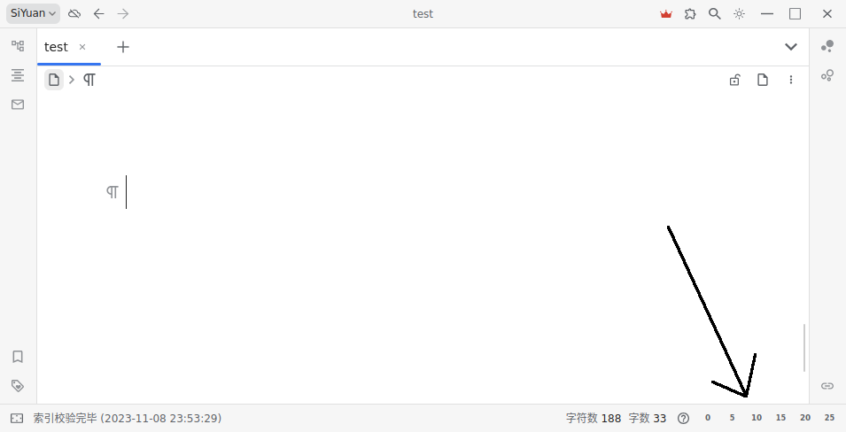

[English](https://github.com/IAliceBobI/sy-tomato-plugin/blob/main/README.md)

# 番茄工具箱

## 番茄钟

*状态栏番茄钟*



* **0**：取消倒计时
* **5**：计时五分钟
* ……
* **25**：计时二十五分钟


## 内容提醒

*给一个内容块设置个提醒日期吧！*

### 先鼠标点击要提醒的内容，然后 `Shift+Alt+P` 打开`命令面板`。也可以用快捷键 `Ctrl+3`。

> 必须用鼠标点击，插件才能知道要处理哪个内容块。键盘移动光标，插件无法感知。


### 选择 `给当前内容块设置一个提醒日期` 这个命令。也可以用快捷键 `Ctrl+3`。


### 设置时间


### 提醒


## 阅读点

*阅读点也就是一个文档上次阅读到的位置，我们把它记录到`书签`里面，并且自动删除当前文件内的其他`书签`。以保持本文件内只有一个`书签`。*

### 先鼠标点击要设置的`内容块`，然后可以 `Shift+Alt+P` 选择 `设置阅读点`，也可以直接 `Ctrl+2`。

> 必须用鼠标点击，插件才能知道要处理哪个内容块。键盘移动光标，插件无法感知。


### 之后要查看`书签`可以，可以直接看`书签面板`。也可以点击右上角的 `阅读点` (ctrl+4) 图表，查看更加详细的信息。


> **注意** `阅读点` 图表的分组方式与书签面板的不一样。

## 清理失效`闪卡`

*如果闪卡所在的内容被我们删除了，这样的失效闪卡还存在于磁盘中。我们可以对其进行删除。*

### 打开命令面板，选择 `清理所有失效闪卡`


> **注意** 正在重建索引的时候，不要使用该功能。正在重建中的索引还不完善，插件依赖索引时会被误导，导致误删闪卡。

> **注意** 如果把`笔记本`关闭后使用，正常的闪卡也会被认为是失效的闪卡。所以使用时要打开全部笔记本。

> **注意** 使用前做好备份！

## 超长内容操作

*超长内容的复制、移动、删除操作让我发疯！这里我使用了一种朴素的方法来对付这样的操作！*

> 操作后，如果发现内容缺失，请F5刷新一下，那只是操作太快，页面没来得及更新！

### 移动操作

*假设有`文档1`与`文档2`，在`文档1`中，用`aacc1`、`aacc2`两行包裹住要移动的内容，然后在`文档2`的某个位置插入`aacc3`，最后打开`命令面板`，选择`批量移动大量连续内容`即可*

> **注意** `文档1`与`文档2` 可以是同一个文档，也就是在同一个文档内移动或者复制。

```
《文档1》

在黄昏的余晖中，
我漫步于林间的小径。
脚下的落叶沙沙作响，
微风轻拂着我的脸庞。

aacc1

枝叶间透出一丝光明，
如同岁月的记忆在闪烁。
我静静地倾听自然的呼吸，
感受生命在这片宁静中延续。

...这里有巨多内容...

这是一段与自然的对话，
我倾听着它们的声音，
我的心灵在这片宁静中得到滋养，
与大自然相互交融，共舞着生命的旋律。

aacc2

在这个喧嚣的世界中，
我寻找到了属于自己的一方净土。
在大自然的怀抱中，
我找到了宁静与自由的力量。
```

```
《文档2》

...
aacc3
...

```


### 复制操作

*类似移动操作，但要选择复制命令。*

### 删除操作

*类似移动操作，但要选择删除命令，且无需写`aacc3`。*

## 快速把列表制作为闪卡

对于一个列表:

* a0
* a1
  * a2
    * a3

原先要想给整个列表制卡比较麻烦，需要选择这个列表。如果点击这个列表的随意一个位置就可制卡，那就方便了。于是有了这个`列表快速制卡`的功能。

> 必须用鼠标点击，插件才能知道要处理哪个内容块。键盘移动光标，插件无法感知。

我们可以把光标放在 `a3` 上，或者其他地方，`a2`、`a1`、`a0`都行，然后 `Ctrl+1`。或者打开`命令面板`选择`添加列表闪卡`。

## 欢迎交流

QQ群: 263961482

