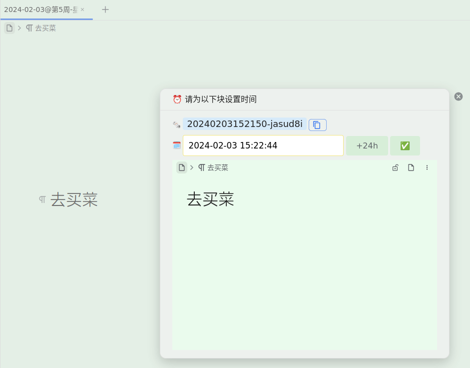
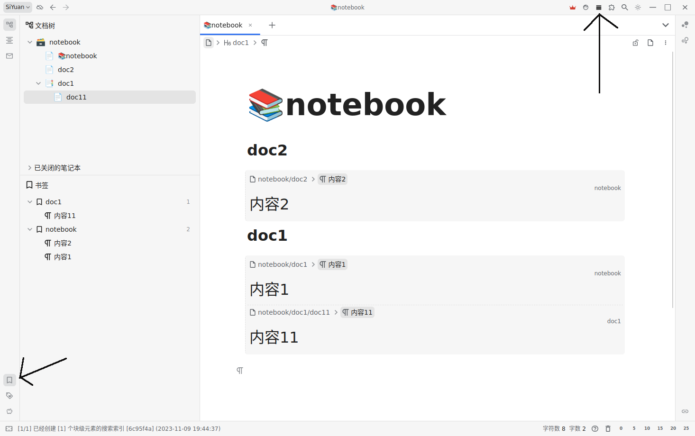

[SRC/源码](https://github.com/IAliceBobI/sy-plugins/tree/main/sy-tomato-plugin)

[English](https://github.com/IAliceBobI/sy-plugins/blob/main/sy-tomato-plugin/README.md)

# 番茄工具箱

> [我猜下面的图九成九是裂开了😢，看这里吧！](https://gitee.com/TokenzQdBN/sy-plugins/blob/main/sy-tomato-plugin/README_zh_CN.md)

## 配置


## 番茄钟

*状态栏番茄钟*


* **0**：取消倒计时
* **5**：计时五分钟
* ……
* **25**：计时二十五分钟


## 底部反链区

加入类似 `logseq` 的底部反链区。并对列表/大纲块，做了特殊处理，能看到相关的上级项，直到根部。其他非列表的块，则直接复制。

例如整个列表为：


在`皂荚`文档内，看到的只有相关信息，直到根部，其他分支隐藏。


**使用方法： 右键，插件->刷新底部反链**

> 分为嵌入块和直接复制两种模式。


## 极简反链


## 双向互链

如图两个文档《皂荚》、《山羊》，皂荚中引用了山羊的`aa`，`bb`两个块，我们对皂荚中内容使用`双向互链`功能，则会在山羊文档相关内容后添加反回皂荚的链接。

快捷键：`Alt+/`


> **提示** 可以多行选择，但需要使用快捷键：`Alt+/`。

## 内容提醒

*给一个内容块设置个提醒日期吧！*

**光标定位好要选择的`内容块`**


**使用右键菜单。也可以用快捷键 `Ctrl+3`。**


**设置时间**



*设置时间好，会自动加上一个时间tag。*


*我们可以在tag面板查看已经计划中的提醒都有哪些。*


**提醒**


**删除时间tag**

*目前需要用户动手自给自足！*

## 阅读点

*阅读点也就是一个文档上次阅读到的位置，我们把它记录到`书签`里面，并且自动删除当前文件内的其他`书签`。以保持本文件内只有一个`书签`。*

**光标定位好要选择的`内容块`，使用右键菜单，也可以直接 `Ctrl+2`。**


**之后要查看`书签`可以，可以直接看`书签面板`。也可以点击右上角的 `阅读点` (ctrl+4) 图标，查看更加详细的信息。**



> **注意** `阅读点` 图标的分组方式与书签面板的不一样。

## 清理失效`闪卡`

*如果闪卡所在的内容被我们删除了，这样的失效闪卡还存在于磁盘中。我们可以对其进行删除。*

**打开命令面板，选择 `清理所有失效闪卡`**


> **注意** 正在重建索引的时候，不要使用该功能。正在重建中的索引还不完善，插件依赖索引时会被误导，导致误删闪卡。

> **注意** 如果把`笔记本`关闭后使用，正常的闪卡也会被认为是失效的闪卡。所以使用时要打开全部笔记本。

> **注意** 使用前做好备份！

## 超长内容操作

*超长内容的复制、移动、删除操作让我发疯！这里我使用了一种朴素的方法来对付这样的操作！*

> 操作后，如果发现内容缺失，请F5刷新一下，那只是操作太快，页面没来得及更新！

### 移动操作

*假设有`文档1`与`文档2`，在`文档1`中，用`aacc1`、`aacc2`两行包裹住要移动的内容，然后在`文档2`的某个位置插入`aacc3`，最后打开`命令面板`，选择`批量移动大量连续内容`即可*

**此移动操作会连同`闪卡`一起转移，不会改变`闪卡`的复习现状。而简单的`ctrl+c,v`会让涉及到的`闪卡`失效。**

> **注意** `文档1`与`文档2` 可以是同一个文档，也就是在同一个文档内移动或者复制。

> **注意** `aacc1`、`aacc2`、`aacc3` 前后不能有空格，不然插件找不到。

```
《文档1》

在黄昏的余晖中，
我漫步于林间的小径。
脚下的落叶沙沙作响，
微风轻拂着我的脸庞。

aacc1

枝叶间透出一丝光明，
如同岁月的记忆在闪烁。
我静静地倾听自然的呼吸，
感受生命在这片宁静中延续。

...这里有巨多内容...

这是一段与自然的对话，
我倾听着它们的声音，
我的心灵在这片宁静中得到滋养，
与大自然相互交融，共舞着生命的旋律。

aacc2

在这个喧嚣的世界中，
我寻找到了属于自己的一方净土。
在大自然的怀抱中，
我找到了宁静与自由的力量。
```

```
《文档2》

...
aacc3
...

```


### 复制操作

*类似移动操作，但要选择复制命令。*

### 删除操作

*类似移动操作，但要选择删除命令，且无需写`aacc3`。*

## 快速把列表制作为闪卡

对于一个列表:

* a0
* a1
  * a2
    * a3

原先要想给整个列表制卡比较麻烦，需要选择这个列表。如果只要光标在这个列表的随意一个位置就可制卡，那就方便了。于是有了这个`列表快速制卡`的功能。

我们可以把光标放在 `a3` 上，或者其他地方，`a2`、`a1`、`a0`都行，然后 `Ctrl+1`。或者打开`命令面板`选择`添加列表闪卡`。

**或者使用右键菜单**


# BUG反馈、建议

插件需要大家包括我，在长期使用中改进，如有问题、建议可以一起讨论。

QQ群: 263961482

[或者到 Github 提交问题](https://github.com/IAliceBobI/sy-plugins/issues)

[或者到官方论坛提交问题](https://ld246.com/tag/siyuan)

# 更新日志

## 2023-12-03

* 加入仿 `logseq` 的底部反链区。

## 2023-12-02

* 重构

## 2023-12-01

* 可配置各种功能是否开启。
* 增加极简反链面板。

## 2023-11-29

* 代码重构。
* 提醒部分使用svelte重写。
* 批量移动，删除，复制前检查block的存在性。避免引起重建索引。

## 2023-11-27

* 双向互链：把光标处的动锚改为静态的。并弹出提醒。

## 2023-11-25

* 支持复制带修改过外观的内容。
* 双向互链：给被链接的内容添加反向链接。

## 2023-11-22

* 修复BUG，删除失效闪卡功能误删文档闪卡。

## 2023-11-18

* 增加内容菜单

## 2023-11-16

* 长内容操作后要等索引4秒钟，更加稳妥。

## 2023-11-15

* 库做了重构，为了保持我们用的代码一致，只能更新一下版本了。
* 更新README。
* 定时提醒设置后，会自动加上时间TAG。

## 2023-11-14

* 长文本复制时，复制品要删除闪卡属性。

## 2023-11-13

* 提升`阅读点`相关的操作流畅度。

## 2023-11-12

* 如果索引有问题，闪卡制作会失败。已经增加失败提示。
* 也推到Gitee。

## 2023-11-10

* 提升操作流畅度
* 修复长内容复制的BUG

## 2023-11-08

* 第一版
